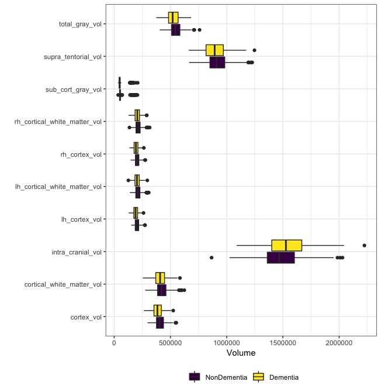

```{r setup, include=FALSE}
knitr::opts_chunk$set(echo = TRUE, warning = F, message = F)

library(tidyverse)
library(ggplot2)
library(caret)
```


## Introduction

The Open Access Series of Imaging Studies (OASIS) is a project whose aim is to encourage open analysis of neuroimaging datasets in the scientific community through free distribution and compilation. The OASIS-3 release is a retrospective compilation of longitudinal neuroimaging, clinical, cognitive, and biomarker data of 1098 participants in several research studies at the Charles F. and Joanne Knight Alzheimer's Disease Research Center at Washington University in St. Louis over the course of 30 years. Of included participants, 609 are cognitively normal and 489 are in various stages of cognitive decline, with ages ranging from 42 - 95 years.

Among the subjects in the dataset, we sought to (1) understand whether there was an underlying latent structure to the data, using unsupervised learning methods, and (2) develop a model to predict whether a patient is cognitively normal or suffering from some symptoms of dementia based on software-generated anatomical brain volumes from MRI scans, genotype of an Alzheimers risk allele, age, height, and weight.

## Data

*Data prep and cleaning*

First, we needed to define a rule for matching clinical measurements and MRI data on time. We chose to match based on the closest year, with a 6-month buffer. When multiple measurements were taken in a single year, we relied on the latest measurement for simplicity.

Although all patients underwent baseline clinical evaluations, some patients only began MRI screens many years into the study. To avoid constraining our sample size too much, after matching the appropriate clinical measurement to the MRI measurements, we did not slice the data on one specific year from baseline; rather, we took the last measurement available for each subject, in the hopes of capturing a more diverse pool of cognitive decline. This leaves us with data from 997 participants, whose clinical and MRI data are matched on time-point.

We dichotomized the outcome into dementia/non-dementia by classifying a  CDR (Clinical Dementia Rating) score of 0 as non-dementia, and CDR > 0 as dementia. We do not consider a multi-class classification model, because of the imbalance of classes (Table 1).

Another variable present in the data was APOE genotype. APOE is a blood protein, and allelic variants of APOE have been associated with increased (e4) or decreased (e2) risk of Alzheimer’s. Each respective allele copy confers increased or decreased risk in a relatively monotonic fashion, where multiple copies of e4, for example, would be associated with greater risk than a single copy (Gong et. al, 2017). Therefore, rather than coding as a categorical variable all the possible allelic combinations of the APOE genotype, we coded two predictor variables representing the counts of protective and risk alleles in a given subject.

Based on visual inspection, the presence of risk and protective alleles may be important as a risk factor for dementia (Figure 1). Further, we noted small differences in cortical volumes (aside from total intracranial volume, which is a corrective factor not strictly of interest): white matter volume, cortex volume, and grey volume seem slightly smaller in the dementia group. 

We prepared our data by processing our predictors to find linear combinations and multicollinearity. When predictors are collinear, models give unreasonable weight to the same information, which can result in biased predictions. We found that many anatomical volumes were functions of other anatomical volumes or highly correlated with other anatomical volumes (>.80), and so dropped total cortex volume, cortical white matter volume, total gray volume, supratentorial volume, left hemisphere cortical white matter volume, and right hemisphere cortex volume from the model. We retained the counts of risk and protective alleles, total intracranial volume (a proxy for head size), left hemisphere cortex volume, and right hemisphere cortical white matter volume. In addition, we centered and scaled the data for correct performance on distance-based models  based on the training data. Less than 10% of data were missing for any given predictor, so data was imputed using k-nearest neighbors based on the training data.

We consider patient age (42-97), number of protective alleles (0-2), number of risk alleles (0-2), height, weight, intracranial volume, left hemisphere cortex volume, and right hemisphere cortical white matter volume as potential predictors of dementia.

*Exploratory analysis*

To answer our questions, we subverted the longitudinal nature of the data and chose to look at a single moment in time.

We already knew our outcome of interest, which inherently dichotomizes the patients. However, we conducted a few unsupervised learning techniques to see whether there was any interesting and interpretable underlying structure that we could leverage in our model building. In looking at the results of k-means clustering and principal component analysis (PCA), there appear to be (possibly) three clusters of patients. According to PCA, we see three components with the following variables: (a) physical attributes:  height, weight, intracranial volume, left hemisphere cortex volume, and right hemisphere cortical white matter volume; (b) genetic component: protective and risk allele counts; and (c) demographics: age (Figure 2). We noticed a large degree of overlap among dementia and non-dementia patients (Figure 3), which was reinforced by hierarchical clustering (optimal k selected by cross-validation was 1). We suspect that building a highly predictive model with our selected variables may be difficult as a result of this overlap. 

## Models

*Model selection*

To predict our outcome, we trained and compared a variety of model types, including logistic regression, linear discriminant analysis (LDA), K-nearest neighbors (KNN), naive Bayes, classification tree (CART), gradient boosting machine (GBM, with xgboost implementation and classic implementation), random forest classifier, and support vector machine (SVM). We split the full dataset (n=997) into training and test dataset at a 2:1 ratio. Model selection was made based on cross-validated training AUC from 10-fold cross-validation repeated 5 times. Model tuning was conducted iteratively based on cross-validated AUC. Final tuning parameter selections are in Table 2.  

The best-performing models were LDA and logistic regression, with training AUCs of about 0.8. SVM performed similarly, but other models fell increasingly short. The worst-performing model was CART, with an AUC of about 0.69 (Figure 4). Test AUC deviated from the training AUC in varying degrees across the models (Figure 4). Of note, the test AUC for KNN and Random Forest was higher than the training AUC. The logistic model, has the highest test AUC. Based on these results, we recommend using the logistic model in light of its performance (training AUC) and interpretability (compared to LDA).

*Model interpretation*

Our logistic model found that the variables risk allele e4 (OR=1.6744, p-value<0.0001), intracranial volume (OR=6.261, p-value<0.0001), LH cortex volume (OR=0.2937, p-value<0.0001), and RH cortical white matter volume (OR=0.4643, p-value<0.0001) are significant predictors of dementia. Since we standardized (centered and scaled) our data, these odds ratios are for one standard deviation change in the respective predictors. We were not expecting intracranial volume to be a significant predictor, since intracranial volume simply represents head size. 

In the linear discriminant analysis Bayesian framework, we found similar effects of the predictors. The average values of those classified in dementia class were 0.33 standard deviations higher in age; 0.07 s.d. lower protective e2 allele count; 0.28 s.d. higher risk e4 allele count; 0.05 s.d. greater height; 0.02 s.d. lower weight; 0.211 s.d. higher intracranial volume; 0.376 s.d. lower LH cortex volume; and 0.147 lower s.d. RH cortical white matter volume.

In SVM, which also performed well, 356 support vectors were found. The best cost parameter was relatively high (1.98), which means that misclassification was more tolerated. This is appropriate for our dataset given that the classes are not obviously separable, as seen in our exploratory data analysis.

##Conclusions

Overall, tree-based methods (CART, GBM, random forest) performed poorly compared to standard methods which are based on a linear decision boundary (logistic regression, LDA). Our support vector machine, which like tree-based methods can capture a non-linear decision boundary but has the advantage of selecting for a global optimum, performed similarly to logistic regression and LDA based on cross-validated AUC. Additionally, the SVM with a radial kernel performed no better than the SVM with a linear kernel, based on cross-validated AUC. Taken as a whole, this evidence suggests that our true decision boundary in these data is perhaps linear or has non-linearities that our more flexible models did not find. 

We were surprised to see AUCs of 0.8 for our best models, as these were higher than what we expected given the degree of overlap between the two patient groups. Predictive capability may also improve with additional covariates, but the data was fairly limited in the information provided. That being said, with an AUC of 0.8, this model wouldn’t be an adequate substitute for expert medical opinion and consideration of clinical presentation. 

## References					

Gong, L. et al. Convergent and divergent effects of apolipoprotein E e4 and e2 alleles on amygdala functional networks in nondemented older adults. Neurobiol. Aging 54, 31–39 (2017). 

\newpage

## Tables and Figures


```{r, echo=F}
cog_data = readRDS("./data/cog_data.RDS")
```


```{r, echo=F}
data.frame(CDR = c(0, 0.5, 1, 2, 3),
           `Number of patients` = c(694, 213, 82, 7, 1)) %>%
  knitr::kable(caption = "Number of patients at each CDR level. This imbalance in counts is what led us to dichotomize the outcome into dementia vs normal cognition.") 
```

\clearpage

```{r, echo=F}
data.frame(Model = c("Logistic", "LDA", "KNN", rep("CART", 2), rep("Naive Bayes", 3), rep("GBM", 4), rep("Xgboost", 7), rep("Random Forest", 3), rep("SVM", 2)),
           `Tuning Parameter` = c("None", "None", "k", "Cp (Max ROC)", "Cp (1 s.d. rule)", "Kernel", "LaPlace Smoother", "Density Adjustment", "Number of trees", "Interaction depth", "Shrinkage (Learning Rate)", "Minimum observation in node", "Number of rounds (trees)", "Interaction depth", "Eta (Learning Rate)", "Gamma", "Column sampling", "Minimum child weight", "Subsample", "Mtry", "Split rule", "Minimum observations in node", "Cost", "Kernel"),
           `Selected Value` = c("", "", 65, 0.005618, 0.028856, "Non-parametric", 1, 2, 5000, 5, 0.001, 1, 600, 2, 0.015, 0.5, 0.8, 2, 0.75, 4, "Gini Index", 6, 1.982206, "Linear")
        ) %>%
  knitr::kable(.,"latex", booktabs = T, escape = F, linesep = "", caption = "Tuning parameters and selected values. Selection was made based on cross-validated AUC (using the train function in the 'caret' package.") %>%
  kableExtra::kable_styling() %>%
  kableExtra::column_spec(1, bold=T) %>%
  kableExtra::row_spec(c(1, 3, 6:8, 13:19, 23:24) - 1, extra_latex_after = "\\rowcolor{gray!6}") %>%
  kableExtra::collapse_rows(1, latex_hline = "none")
```

\clearpage




