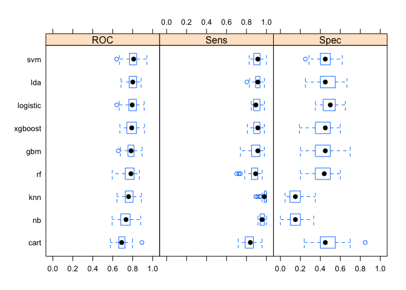
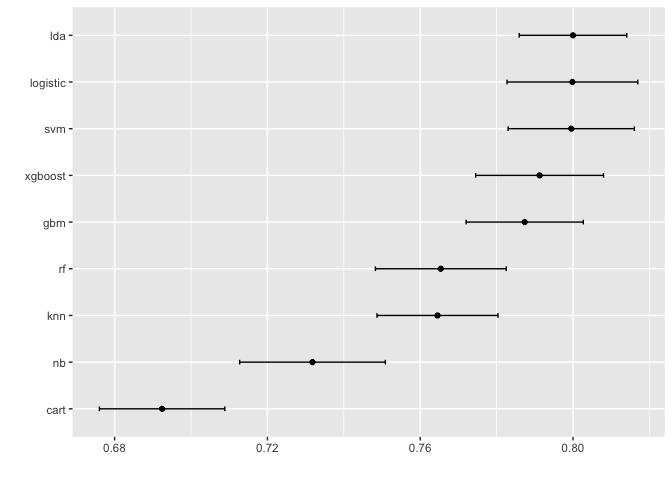
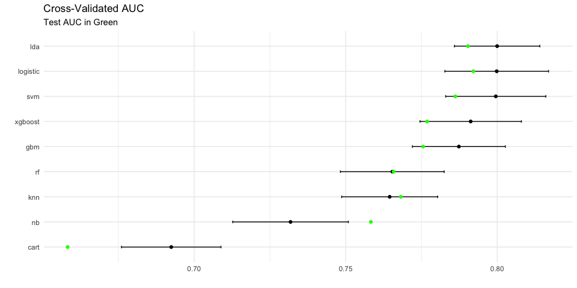

Final Model Selection
================
Laura Cosgrove
5/10/2019

``` r
library(caret)
```

    ## Loading required package: lattice

    ## Loading required package: ggplot2

    ## Registered S3 methods overwritten by 'ggplot2':
    ##   method         from 
    ##   [.quosures     rlang
    ##   c.quosures     rlang
    ##   print.quosures rlang

``` r
library(tidyverse)
```

    ## Registered S3 method overwritten by 'rvest':
    ##   method            from
    ##   read_xml.response xml2

    ## ── Attaching packages ────────────────────────────────────────────────────────────────────────────────────────────── tidyverse 1.2.1 ──

    ## ✔ tibble  2.1.1       ✔ purrr   0.3.2  
    ## ✔ tidyr   0.8.3       ✔ dplyr   0.8.0.1
    ## ✔ readr   1.3.1       ✔ stringr 1.4.0  
    ## ✔ tibble  2.1.1       ✔ forcats 0.4.0

    ## ── Conflicts ───────────────────────────────────────────────────────────────────────────────────────────────── tidyverse_conflicts() ──
    ## ✖ dplyr::filter() masks stats::filter()
    ## ✖ dplyr::lag()    masks stats::lag()
    ## ✖ purrr::lift()   masks caret::lift()

``` r
library(pROC)
```

    ## Type 'citation("pROC")' for a citation.

    ## 
    ## Attaching package: 'pROC'

    ## The following objects are masked from 'package:stats':
    ## 
    ##     cov, smooth, var

# resamples

``` r
gbm_fit = readRDS("./data/gbm_fit_3.RDS")
xgb_fit = readRDS("./data/xgboost.RDS")
svm_fit = readRDS("./data/SVM.RDS")
rf_fit = readRDS("./data/rf.fit.RDS")
knn_fit = readRDS("./data/knn.RDS")
nb_fit  = readRDS("./data/nb.RDS")
logit_fit  = readRDS("./data/logit.RDS")
lda_fit = readRDS("./data/lda.RDS")
cart_fit = readRDS("./data/cart.RDS")

set.seed(2)
resamp <- resamples(list(xgboost = xgb_fit,
                         gbm = gbm_fit,
                        svm = svm_fit,
                         rf = rf_fit,
                         knn = knn_fit,
                         nb = nb_fit,
                         logistic = logit_fit,
                         lda = lda_fit, 
                         cart = cart_fit))
bwplot(resamp)
```

<!-- -->

``` r
ggplot(resamp)
```

<!-- -->

``` r
summary(resamp)
```

    ## 
    ## Call:
    ## summary.resamples(object = resamp)
    ## 
    ## Models: xgboost, gbm, svm, rf, knn, nb, logistic, lda, cart 
    ## Number of resamples: 50 
    ## 
    ## ROC 
    ##               Min.   1st Qu.    Median      Mean   3rd Qu.      Max. NA's
    ## xgboost  0.6712766 0.7437500 0.7900362 0.7912418 0.8371151 0.9180851    0
    ## gbm      0.6565217 0.7541149 0.7840426 0.7873418 0.8127717 0.8945652    0
    ## svm      0.6391304 0.7690217 0.8090426 0.7995225 0.8378585 0.9420290    0
    ## rf       0.5952381 0.7281337 0.7820652 0.7653794 0.8130809 0.8663043    0
    ## knn      0.6423913 0.7260870 0.7583372 0.7645090 0.8029382 0.8877660    0
    ## nb       0.5936170 0.6842391 0.7331522 0.7318003 0.7739130 0.8797872    0
    ## logistic 0.6403242 0.7613437 0.7947981 0.7998271 0.8369565 0.9148936    0
    ## lda      0.6826087 0.7653339 0.8006470 0.7999751 0.8382979 0.8840580    0
    ## cart     0.5760870 0.6615815 0.6895120 0.6924352 0.7199728 0.8923913    0
    ## 
    ## Sens 
    ##               Min.   1st Qu.    Median      Mean   3rd Qu.      Max. NA's
    ## xgboost  0.8085106 0.8770814 0.9130435 0.9050139 0.9347826 0.9787234    0
    ## gbm      0.7391304 0.8556892 0.9130435 0.8941443 0.9347826 0.9782609    0
    ## svm      0.8260870 0.8770814 0.9130435 0.9109898 0.9361702 1.0000000    0
    ## rf       0.7021277 0.8510638 0.8913043 0.8761055 0.9130435 0.9574468    0
    ## knn      0.8936170 0.9782609 0.9782609 0.9766975 1.0000000 1.0000000    0
    ## nb       0.9148936 0.9412581 0.9569843 0.9632932 0.9787234 1.0000000    0
    ## logistic 0.8478261 0.8695652 0.8936170 0.9041351 0.9347826 0.9787234    0
    ## lda      0.8043478 0.8913043 0.9130435 0.9079741 0.9347826 0.9787234    0
    ## cart     0.7173913 0.7915125 0.8388067 0.8359389 0.8695652 0.9565217    0
    ## 
    ## Spec 
    ##                Min.   1st Qu.    Median      Mean   3rd Qu.      Max. NA's
    ## xgboost  0.19047619 0.3577381 0.4500000 0.4405714 0.5000000 0.6000000    0
    ## gbm      0.20000000 0.3577381 0.4500000 0.4449048 0.5000000 0.7000000    0
    ## svm      0.25000000 0.4000000 0.4500000 0.4545714 0.5000000 0.6190476    0
    ## rf       0.20000000 0.3500000 0.4392857 0.4218095 0.5000000 0.6000000    0
    ## knn      0.04761905 0.0952381 0.1500000 0.1489524 0.2000000 0.3500000    0
    ## nb       0.00000000 0.1000000 0.1500000 0.1490476 0.2000000 0.3333333    0
    ## logistic 0.35000000 0.4285714 0.5000000 0.4899524 0.5500000 0.6500000    0
    ## lda      0.25000000 0.4000000 0.4500000 0.4672381 0.5500000 0.6666667    0
    ## cart     0.23809524 0.4000000 0.4500000 0.4596190 0.5434524 0.8500000    0

Looks like logistic regression it is :)

# test performance

``` r
cog_test <- readRDS("./data/cog_test_preproc.RDS")
```

``` r
## Function

confusionMatrix_fcn = function(fit) {
  test_pred  <- predict(fit, cog_test, type = "raw")

 matrix <- confusionMatrix(data = test_pred, 
                reference = cog_test$cdr,
                positive = "Dementia")
 matrix
}

roc_fcn = function(fit) {
test_pred_prob  <- predict(fit, cog_test, type = "prob")

roc_test <- roc(cog_test$cdr, test_pred_prob$Dementia)
 
roc_test$auc[1]
}

auc_list = list(xgboost = xgb_fit,
                         gbm = gbm_fit,
                        svm = svm_fit,
                         rf = rf_fit,
                         knn = knn_fit,
                         nb = nb_fit,
                         logistic = logit_fit,
                         lda = lda_fit, 
                         cart = cart_fit) %>%  map(roc_fcn) 
```

    ## Warning in FUN(X[[i]], ...): Numerical 0 probability for all classes with
    ## observation 325

``` r
auc_df = tibble(models = resamp$models, auc = auc_list) %>% 
  unnest()

ggplot(resamp) + theme_minimal() + 
  geom_point(data = auc_df, aes(y = auc, x = models), color = "green") + 
  labs(title = "Cross-Validated AUC",
       subtitle = "Test AUC in Green")
```

<!-- -->
