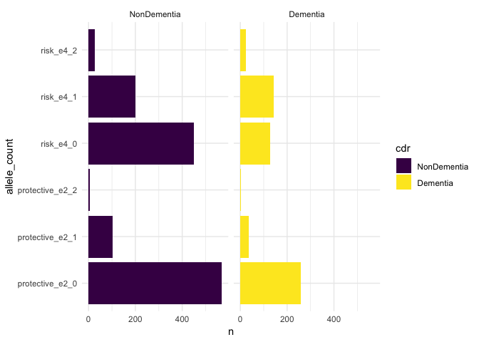

Data Preparation
================
Laura Cosgrove
5/1/2019

``` r
library(tidyverse)
```

    ## Registered S3 methods overwritten by 'ggplot2':
    ##   method         from 
    ##   [.quosures     rlang
    ##   c.quosures     rlang
    ##   print.quosures rlang

    ## Registered S3 method overwritten by 'rvest':
    ##   method            from
    ##   read_xml.response xml2

    ## ── Attaching packages ────────────────────────────────────────────────── tidyverse 1.2.1 ──

    ## ✔ ggplot2 3.1.1       ✔ purrr   0.3.2  
    ## ✔ tibble  2.1.1       ✔ dplyr   0.8.0.1
    ## ✔ tidyr   0.8.3       ✔ stringr 1.4.0  
    ## ✔ readr   1.3.1       ✔ forcats 0.4.0

    ## ── Conflicts ───────────────────────────────────────────────────── tidyverse_conflicts() ──
    ## ✖ dplyr::filter() masks stats::filter()
    ## ✖ dplyr::lag()    masks stats::lag()

# Introduction to Dataset

The Open Access Series of Imaging Studies (OASIS) is a project whose aim
is to encourage open analysis of neuroimaging datasets in the scientific
community through free distribution and compilation. The OASIS-3 release
is a retrospective compilation of longitudinal neuroimaging, clinical,
cognitive, and biomarker data of 1098 participants in several research
studies at the Charles F. and Joanne Knight Alzheimer’s Disease Research
Center at Washington University i n St. Louis over the course of 30
years. Of included participants, 609 are cognitively normal and 489 are
in various stages of cognitive decline, with ages ranging from 42 - 95
years.

First, we’ll prepare the data by coding the longitudinal IDs to days and
years:

``` r
freesurfer = read_csv("./data/freesurfer.csv") %>% 
  janitor::clean_names() %>% 
  select(-fs_date, -included_t1s)
```

    ## Parsed with column specification:
    ## cols(
    ##   `FS_FSDATA ID` = col_character(),
    ##   Session = col_character(),
    ##   Subject = col_character(),
    ##   `FS Date` = col_logical(),
    ##   `Included T1s` = col_logical(),
    ##   IntraCranialVol = col_double(),
    ##   lhCortexVol = col_double(),
    ##   rhCortexVol = col_double(),
    ##   CortexVol = col_double(),
    ##   SubCortGrayVol = col_double(),
    ##   TotalGrayVol = col_double(),
    ##   SupraTentorialVol = col_double(),
    ##   lhCorticalWhiteMatterVol = col_double(),
    ##   rhCorticalWhiteMatterVol = col_double(),
    ##   CorticalWhiteMatterVol = col_double()
    ## )

``` r
clinical_data = read_csv("./data/ClinicalData.csv") %>% 
  janitor::clean_names() %>% 
  select(-date, -age)
```

    ## Parsed with column specification:
    ## cols(
    ##   .default = col_double(),
    ##   `ADRC_ADRCCLINICALDATA ID` = col_character(),
    ##   Subject = col_character(),
    ##   Date = col_logical(),
    ##   Age = col_logical(),
    ##   dx1 = col_character(),
    ##   dx2 = col_character(),
    ##   dx3 = col_character(),
    ##   dx4 = col_character(),
    ##   dx5 = col_character(),
    ##   acsparnt = col_logical(),
    ##   primStudy = col_logical(),
    ##   acsStudy = col_logical()
    ## )

    ## See spec(...) for full column specifications.

``` r
#year preparation 
clinical_data <- clinical_data %>% 
  mutate(day = str_extract(adrc_adrcclinicaldata_id, "[^_]+$"),
         day = as.numeric(str_remove(day, "d")),
         year = day/365,
         subject = as.numeric(str_remove(subject, "OAS")))

freesurfer <- freesurfer %>% 
   mutate(day = str_extract(fs_fsdata_id, "[^_]+$"),
         day = as.numeric(str_remove(day, "d")),
         year = day/365,
         subject = as.numeric(str_remove(subject, "OAS"))) 
```

# Exploratory Data Analysis

First, we examine the longitudinal structure of the data. What does the
Freesurfer-derived MRI data look like over time when patients are
classified based on their highest diagnosed CDR (Clinical Dementia
Rating) score?

``` r
#List of highest-ever CDR score
subjects_ever_dementia <- clinical_data %>% 
  distinct(subject, cdr, year) %>%
  mutate(year = glue::glue("year_{round(year)}")) %>% 
  rowid_to_column() %>% 
  spread(year, cdr) 

year_cols <- subjects_ever_dementia %>% select(year_1:year_9) %>% names()

subjects_ever_dementia <- subjects_ever_dementia %>% 
  mutate_all(~replace(., is.na(.), 0)) %>% 
  mutate(cdr_highest = pmax(!!!rlang::syms(year_cols))) %>% 
  mutate(cdr_highest = factor(cdr_highest)) %>% 
  select(subject, cdr_highest)
```

``` r
#ICV/eTIV
freesurfer %>% 
  left_join(subjects_ever_dementia, by = "subject") %>% 
  ggplot(aes(y = intra_cranial_vol, x = year, group = subject, color = cdr_highest)) +
  facet_wrap(~cdr_highest, nrow = 2) +
  geom_line() + theme_minimal() + scale_color_viridis_d()
```

    ## geom_path: Each group consists of only one observation. Do you need to
    ## adjust the group aesthetic?

<!-- -->

``` r
#Total gray volume/icv
freesurfer %>% 
  left_join(subjects_ever_dementia, by = "subject") %>% 
  ggplot(aes(y = total_gray_vol/intra_cranial_vol, x = year, group = subject, color = cdr_highest)) +
  facet_wrap(~cdr_highest, nrow = 2) +
  geom_line() + theme_minimal() + scale_color_viridis_d()
```

    ## geom_path: Each group consists of only one observation. Do you need to
    ## adjust the group aesthetic?

<!-- -->

``` r
#below doesn't look great, maybe b/c of different methods: NOTE: SubCortGray excludes brain stem and cerebellum with 5.2.
freesurfer %>% 
  left_join(subjects_ever_dementia, by = "subject") %>% 
  ggplot(aes(y = sub_cort_gray_vol/intra_cranial_vol, x = year, group = subject, color = cdr_highest)) +
  facet_wrap(~cdr_highest, nrow = 2) +
  geom_line() + theme_minimal() + scale_color_viridis_d()
```

    ## geom_path: Each group consists of only one observation. Do you need to
    ## adjust the group aesthetic?

<!-- -->

``` r
#total white matter/cv
freesurfer %>% 
  left_join(subjects_ever_dementia, by = "subject") %>% 
  ggplot(aes(y = cortical_white_matter_vol/intra_cranial_vol, x = year, group = subject, color = cdr_highest)) +
  facet_wrap(~cdr_highest, nrow = 2) +
  geom_line() + theme_minimal() + scale_color_viridis_d()
```

    ## geom_path: Each group consists of only one observation. Do you need to
    ## adjust the group aesthetic?

<!-- -->

# Selecting a time slice

To proceed with our analysis, we’ll need to abandon the longitudinal
structure of the data. However, we want to preserve as much data as
possible while matching anatomical scores to the outcome.

``` r
clinical_data %>% select(subject, day, year) %>% 
  ggplot(aes(x = year)) +
  geom_histogram()
```

    ## `stat_bin()` using `bins = 30`. Pick better value with `binwidth`.

<!-- -->

``` r
freesurfer %>% select(subject, day, year) %>% 
  ggplot(aes(x = year)) +
  geom_histogram()
```

    ## `stat_bin()` using `bins = 30`. Pick better value with `binwidth`.

<!-- -->

``` r
#Round to closest year in both datasets 
freesurfer <- freesurfer %>% 
  mutate(year_round = round(year))

#Merge and remove nonmatched values: effectively matching +- 6 mo.
merged_data <- clinical_data %>% 
  mutate(year_round = round(year)) %>% 
  left_join(freesurfer, by = c("subject", "year_round")) %>% 
  filter(!is.na(adrc_adrcclinicaldata_id), !is.na(fs_fsdata_id)) %>% 
  rename(year_clinical = year.x, day_clinical = day.x, 
         year_mri = year.y, day_mri = day.y)

#If two entries per year, take the latest one:
merged_data <- merged_data %>% 
  group_by(subject, year_round) %>% 
  summarize_all(last) %>% 
  ungroup()

#Take baseline
baseline_data <- merged_data %>% 
  group_by(subject) %>% 
  summarize_all(first)

#Take the last measurement 
last_data <- merged_data %>% 
  group_by(subject) %>% 
  summarize_all(last)

#Take the 2nd measurement
second_data <- merged_data %>% 
  group_by(subject) %>% 
  summarize_all(~nth(., 2)) %>% 
  filter(!is.na(year_round))

#Take the 3nd measurement
third_data <- merged_data %>% 
  group_by(subject) %>% 
  summarize_all(~nth(., 3)) %>% 
  filter(!is.na(year_round))
```

# Data preparation

First, we needed to define a rule for matching clinical measurements and
MRI data on time. We chose to match based on the closest year,
effectively a +- 6 months of difference. When multiple measurements were
taken in a single year, we relied on the latest measurement for
simplicity.

Although all patients underwent baseline clinical evaluations, some
patients only began MRI screens many years into the study. To avoid
constraining our sample size to a large extent, after matching the
appropriate clinical measurement to the MRI measurements, we did not
slice the data on one specific year from baseline; rather, we took the
last measurement available for each subject, in the hopes of capturing a
more diverse pool of cognitive decline. This leaves us with data from
997 participants, whose clinical and MRI data are matched on time-point.

First, we will dichotomize the outcome into dementia/non dementia by
classifying cdr = 0 as non-dementia, and cdr \> 0 as dementia. We will
not consider a multi-class classification model, because of the
imbalance of classes:

``` r
last_data %>% 
  mutate(cdr = factor(cdr)) %>% 
  count(cdr) %>% 
  knitr::kable()
```

| cdr |   n |
| :-- | --: |
| 0   | 694 |
| 0.5 | 213 |
| 1   |  82 |
| 2   |   7 |
| 3   |   1 |

``` r
cog_data <- last_data %>% 
  mutate(cdr = factor(case_when(cdr == 0 ~ 0,
                                cdr > 0 ~ 1), 
                      levels = c(0, 1),
                      labels = c("Non-Dementia", "Dementia"))) %>% 
  select(-adrc_adrcclinicaldata_id, -fs_fsdata_id, -starts_with("dx"), -starts_with("day")) %>% 
  mutate(age = age_at_entry + year_round) %>% 
  select(subject, age, year_round, cdr, mmse, apoe, height, weight, intra_cranial_vol:cortical_white_matter_vol) 
```

Next, we will code APOE into counts of protective alleles versus risk
alleles:

``` r
#Coding APOE into count of protective allele vs risk allele
cog_data <- cog_data %>% 
  mutate(apoe = as.character(apoe)) %>% 
  separate(apoe, into = c("apoe_one", "apoe_two"), sep = 1) %>% 
  mutate(apoe_one_e2 = if_else(apoe_one == "2", 1, 0),
         apoe_one_e4 = if_else(apoe_one == "4", 1, 0),
         apoe_two_e2 = if_else(apoe_two == "2", 1, 0),
         apoe_two_e4 = if_else(apoe_two == "4", 1, 0)) %>% 
  mutate(protective_e2 = apoe_one_e2 + apoe_two_e2,
        risk_e4 = apoe_one_e4 + apoe_two_e4) %>% 
  select(subject, year_round, cdr, age, mmse, protective_e2, risk_e4, everything(), -starts_with("apoe"))
```

Finally, write our csv:

``` r
write_csv(cog_data, "./data/cog_data")
```

## Plots

``` r
cog_data %>% 
  gather(anatomical_volumes, volume, intra_cranial_vol:cortical_white_matter_vol) %>% 
  ggplot(aes(x = anatomical_volumes, y = volume, fill = cdr)) +
  geom_boxplot() +
  coord_flip() +
  theme_minimal() + scale_fill_viridis_d()
```

<!-- -->

``` r
cog_data %>% 
  gather(allele, count, protective_e2, risk_e4) %>% 
  group_by(cdr, count) %>% 
  count(allele) %>% 
  drop_na() %>% 
  mutate(allele_count = str_c(allele, count, sep = "_")) %>% 
  ggplot(aes(x = allele_count, y = n, fill = cdr)) +
  geom_col() +
  coord_flip() +
  facet_grid(~cdr) + scale_fill_viridis_d() + theme_minimal()
```

<!-- -->

``` r
#Relatively equal distributions, slightly more risk alleles in dementia
table(cog_data$cdr, cog_data$protective_e2)
```

    ##               
    ##                  0   1   2
    ##   Non-Dementia 569 103   6
    ##   Dementia     257  36   2

``` r
table(cog_data$cdr, cog_data$risk_e4)
```

    ##               
    ##                  0   1   2
    ##   Non-Dementia 451 200  27
    ##   Dementia     126 144  25

From this, it appears that the presence of risk alleles may be more
important that the protective alleles as a risk factor for dementia.
Further, we note small differences in cortical volumes (aside from total
intracranial volume, which is a corrective factor not strictly of
interest): white matter volume, cortex volume, and grey volume seem
slightly smaller in the dementia group.
