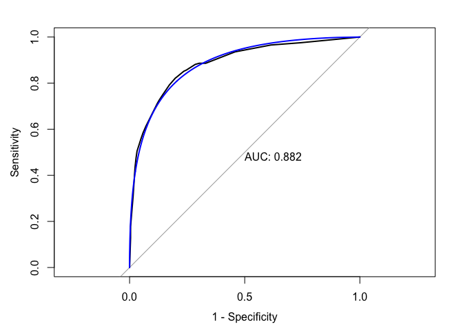

gbm
================
Laura Cosgrove
5/7/2019

``` r
library(tidyverse)
```

    ## Registered S3 methods overwritten by 'ggplot2':
    ##   method         from 
    ##   [.quosures     rlang
    ##   c.quosures     rlang
    ##   print.quosures rlang

    ## Registered S3 method overwritten by 'rvest':
    ##   method            from
    ##   read_xml.response xml2

    ## ── Attaching packages ───────────────────────────────────────────────────────────────── tidyverse 1.2.1 ──

    ## ✔ ggplot2 3.1.1       ✔ purrr   0.3.2  
    ## ✔ tibble  2.1.1       ✔ dplyr   0.8.0.1
    ## ✔ tidyr   0.8.3       ✔ stringr 1.4.0  
    ## ✔ readr   1.3.1       ✔ forcats 0.4.0

    ## ── Conflicts ──────────────────────────────────────────────────────────────────── tidyverse_conflicts() ──
    ## ✖ dplyr::filter() masks stats::filter()
    ## ✖ dplyr::lag()    masks stats::lag()

``` r
library(caret)
```

    ## Loading required package: lattice

    ## 
    ## Attaching package: 'caret'

    ## The following object is masked from 'package:purrr':
    ## 
    ##     lift

``` r
library(ranger)
library(gbm)
```

    ## Loaded gbm 2.1.5

``` r
library(pROC)
```

    ## Type 'citation("pROC")' for a citation.

    ## 
    ## Attaching package: 'pROC'

    ## The following objects are masked from 'package:stats':
    ## 
    ##     cov, smooth, var

``` r
# Using caret
ctrl1 <- trainControl(method = "repeatedcv",
                     repeats = 5,
                     summaryFunction = twoClassSummary, #because we're in the two-class setting
                     classProbs = TRUE) #because need predicted class probabilities to get ROC curve

#Read RDS 
cog_train <- readRDS("./data/cog_train_preproc.RDS")
cog_test <- readRDS("./data/cog_test_preproc.RDS")
```

``` r
set.seed(1)

#tuning 
gbm_grid <- expand.grid(n.trees = c(2000,3000),
                        interaction.depth = 2:10,
                        shrinkage = c(0.01, 0.03, 0.05),
                        n.minobsinnode = 1)

gbm_fit <- train(x = cog_train[3:10],
                 y = cog_train$cdr,
                 method = "gbm",
                 tuneGrid = gbm_grid,
                 trControl = ctrl1,
                 verbose = FALSE)
```

``` r
#Save and reload
#saveRDS(gbm_fit, file = "./data/gbm_fit_1.RDS")
gbm_fit_1 = readRDS("./data/gbm_fit_1.RDS")

ggplot(gbm_fit_1, highlight = TRUE) 
```

<!-- -->

``` r
gbm_fit_1$results[which.max(gbm_fit_1$results$ROC),]
```

    ##   shrinkage interaction.depth n.minobsinnode n.trees      ROC      Sens
    ## 1      0.01                 2              1    2000 0.775709 0.8729232
    ##        Spec      ROCSD     SensSD     SpecSD
    ## 1 0.4590476 0.06380491 0.05331605 0.09311407

``` r
set.seed(12)

gbm_grid_2 <- expand.grid(n.trees = 2000,
                        interaction.depth = 2:8,
                        shrinkage = c(0.0008, 0.001, 0.004),
                        n.minobsinnode = 1)

gbm_fit_2 <- train(x = cog_train[3:10],
                 y = cog_train$cdr,
                 method = "gbm",
                 tuneGrid = gbm_grid_2,
                 trControl = ctrl1,
                 verbose = FALSE)
```

``` r
#Save and reload
#saveRDS(gbm_fit_2, file = "./data/gbm_fit_3.RDS")
gbm_fit_2 = readRDS("./data/gbm_fit_2.RDS")

ggplot(gbm_fit_2, highlight = TRUE) 
```

<!-- -->

``` r
gbm_fit_2$results[which.max(gbm_fit_2$results$ROC),]
```

    ##    shrinkage interaction.depth n.minobsinnode n.trees       ROC      Sens
    ## 13     0.001                 7              1    2000 0.7872218 0.9214524
    ##         Spec      ROCSD     SensSD    SpecSD
    ## 13 0.3349524 0.05902025 0.04258906 0.1093456

``` r
set.seed(12)

gbm_grid_3 <- expand.grid(n.trees = c(2000, 5000),
                        interaction.depth = 4:10,
                        shrinkage = 0.001,
                        n.minobsinnode = 1)

gbm_fit_3 <- train(x = cog_train[3:10],
                 y = cog_train$cdr,
                 distribution = "bernoulli",
                 method = "gbm",
                 tuneGrid = gbm_grid_3,
                 trControl = ctrl1,
                 verbose = FALSE)
```

``` r
#Save and reload
#saveRDS(gbm_fit_3, file = "./data/gbm_fit_3.RDS")
gbm_fit_3 = readRDS("./data/gbm_fit_3.RDS")

ggplot(gbm_fit_3, highlight = TRUE) 
```

<!-- -->

``` r
gbm_fit_3$results[which.max(gbm_fit_3$results$ROC),]
```

    ##   shrinkage interaction.depth n.minobsinnode n.trees       ROC      Sens
    ## 4     0.001                 5              1    5000 0.7873418 0.8941443
    ##        Spec      ROCSD     SensSD     SpecSD
    ## 4 0.4449048 0.05392645 0.04944103 0.09575783

``` r
## variable importance
summary.gbm(gbm_fit_3$finalModel)
```

<!-- -->

    ##                                                       var    rel.inf
    ## lh_cortex_vol                               lh_cortex_vol 28.8358871
    ## intra_cranial_vol                       intra_cranial_vol 24.5316186
    ## age                                                   age 16.1395290
    ## rh_cortical_white_matter_vol rh_cortical_white_matter_vol 10.6188727
    ## weight                                             weight  8.4694267
    ## risk_e4                                           risk_e4  6.2317954
    ## height                                             height  4.4673862
    ## protective_e2                               protective_e2  0.7054842

Test predictions, using gbm model 3:

``` r
##Test Predictions## 

pred_gbm_raw <- predict(gbm_fit_3, newdata = cog_test,
                    n.trees = 5000,
                    type = "raw")

confusionMatrix(data = pred_gbm_raw, 
                reference = cog_test$cdr,
                positive = "Dementia")
```

    ## Confusion Matrix and Statistics
    ## 
    ##              Reference
    ## Prediction    NonDementia Dementia
    ##   NonDementia         208       59
    ##   Dementia             23       42
    ##                                          
    ##                Accuracy : 0.753          
    ##                  95% CI : (0.703, 0.7985)
    ##     No Information Rate : 0.6958         
    ##     P-Value [Acc > NIR] : 0.012513       
    ##                                          
    ##                   Kappa : 0.3515         
    ##                                          
    ##  Mcnemar's Test P-Value : 0.000111       
    ##                                          
    ##             Sensitivity : 0.4158         
    ##             Specificity : 0.9004         
    ##          Pos Pred Value : 0.6462         
    ##          Neg Pred Value : 0.7790         
    ##              Prevalence : 0.3042         
    ##          Detection Rate : 0.1265         
    ##    Detection Prevalence : 0.1958         
    ##       Balanced Accuracy : 0.6581         
    ##                                          
    ##        'Positive' Class : Dementia       
    ## 

``` r
pred_gbm_prob <- predict(gbm_fit_3, newdata = cog_test,
                    n.trees = 5000,
                    type = "prob")

roc_gbm_test <- roc(cog_test$cdr, pred_gbm_prob$Dementia)

plot(roc_gbm_test, legacy.axes = TRUE, print.auc = TRUE) 
plot(smooth(roc_gbm_test), col = 4, add = TRUE) 
```

<!-- -->

# xgboost

``` r
library(xgboost)
```

    ## 
    ## Attaching package: 'xgboost'

    ## The following object is masked from 'package:dplyr':
    ## 
    ##     slice

``` r
#preparing matrix

dtrain <- xgb.DMatrix(data = model.matrix(cdr ~., cog_train[2:10])[,-1], 
                      label = (as.numeric(cog_train$cdr) -1) ) 
dtest <- xgb.DMatrix(data = model.matrix(cdr ~., cog_test[2:10])[,-1],
                     label = (as.numeric(cog_test$cdr) -1) )

set.seed(4)
params <- list(booster = "gbtree", 
               objective = "binary:logistic", 
               eta=0.3, gamma=0, max_depth=6, 
               min_child_weight=1, subsample=1, 
               colsample_bytree=1)

xgbcv <- xgb.cv( params = params, 
                 data = dtrain, 
                 nrounds = 100, 
                 metrics = "auc",
                 nfold = 5, showsd = T, 
                 stratified = T)
```

    ## [1]  train-auc:0.876234+0.021853 test-auc:0.658016+0.022658 
    ## [2]  train-auc:0.925691+0.014919 test-auc:0.697882+0.033032 
    ## [3]  train-auc:0.943586+0.011772 test-auc:0.717112+0.032844 
    ## [4]  train-auc:0.957192+0.007044 test-auc:0.730755+0.027421 
    ## [5]  train-auc:0.966146+0.004860 test-auc:0.732312+0.027293 
    ## [6]  train-auc:0.975278+0.002739 test-auc:0.732494+0.032350 
    ## [7]  train-auc:0.979438+0.002665 test-auc:0.734314+0.035596 
    ## [8]  train-auc:0.984398+0.001390 test-auc:0.738568+0.032535 
    ## [9]  train-auc:0.988253+0.002042 test-auc:0.739450+0.034239 
    ## [10] train-auc:0.989884+0.001974 test-auc:0.742119+0.032811 
    ## [11] train-auc:0.991817+0.001738 test-auc:0.741073+0.032061 
    ## [12] train-auc:0.993912+0.001190 test-auc:0.740095+0.035922 
    ## [13] train-auc:0.995375+0.001440 test-auc:0.741198+0.034279 
    ## [14] train-auc:0.996162+0.001329 test-auc:0.739375+0.033022 
    ## [15] train-auc:0.996996+0.001253 test-auc:0.741806+0.032857 
    ## [16] train-auc:0.997924+0.000849 test-auc:0.738443+0.034481 
    ## [17] train-auc:0.998461+0.000767 test-auc:0.738263+0.035153 
    ## [18] train-auc:0.998807+0.000632 test-auc:0.734617+0.033447 
    ## [19] train-auc:0.999132+0.000526 test-auc:0.732747+0.034708 
    ## [20] train-auc:0.999391+0.000466 test-auc:0.730570+0.037459 
    ## [21] train-auc:0.999595+0.000410 test-auc:0.730445+0.037022 
    ## [22] train-auc:0.999634+0.000347 test-auc:0.731590+0.036679 
    ## [23] train-auc:0.999792+0.000237 test-auc:0.730614+0.035620 
    ## [24] train-auc:0.999888+0.000144 test-auc:0.730262+0.036263 
    ## [25] train-auc:0.999905+0.000141 test-auc:0.729153+0.038446 
    ## [26] train-auc:0.999957+0.000077 test-auc:0.730078+0.036236 
    ## [27] train-auc:0.999951+0.000098 test-auc:0.731542+0.032916 
    ## [28] train-auc:0.999957+0.000085 test-auc:0.731345+0.032388 
    ## [29] train-auc:0.999980+0.000039 test-auc:0.732085+0.031031 
    ## [30] train-auc:0.999980+0.000039 test-auc:0.730901+0.032150 
    ## [31] train-auc:0.999990+0.000020 test-auc:0.729385+0.033150 
    ## [32] train-auc:0.999993+0.000013 test-auc:0.731897+0.034184 
    ## [33] train-auc:0.999997+0.000006 test-auc:0.729819+0.033415 
    ## [34] train-auc:0.999997+0.000006 test-auc:0.729778+0.033741 
    ## [35] train-auc:1.000000+0.000000 test-auc:0.728359+0.033970 
    ## [36] train-auc:1.000000+0.000000 test-auc:0.729555+0.035399 
    ## [37] train-auc:1.000000+0.000000 test-auc:0.727863+0.036858 
    ## [38] train-auc:1.000000+0.000000 test-auc:0.729144+0.036214 
    ## [39] train-auc:1.000000+0.000000 test-auc:0.727941+0.037615 
    ## [40] train-auc:1.000000+0.000000 test-auc:0.727905+0.037401 
    ## [41] train-auc:1.000000+0.000000 test-auc:0.727993+0.038181 
    ## [42] train-auc:1.000000+0.000000 test-auc:0.727817+0.039471 
    ## [43] train-auc:1.000000+0.000000 test-auc:0.727848+0.038875 
    ## [44] train-auc:1.000000+0.000000 test-auc:0.728247+0.038555 
    ## [45] train-auc:1.000000+0.000000 test-auc:0.727238+0.038807 
    ## [46] train-auc:1.000000+0.000000 test-auc:0.726938+0.038550 
    ## [47] train-auc:1.000000+0.000000 test-auc:0.727799+0.039555 
    ## [48] train-auc:1.000000+0.000000 test-auc:0.727304+0.040611 
    ## [49] train-auc:1.000000+0.000000 test-auc:0.728407+0.041070 
    ## [50] train-auc:1.000000+0.000000 test-auc:0.727901+0.039871 
    ## [51] train-auc:1.000000+0.000000 test-auc:0.729081+0.041466 
    ## [52] train-auc:1.000000+0.000000 test-auc:0.729072+0.040339 
    ## [53] train-auc:1.000000+0.000000 test-auc:0.728437+0.040399 
    ## [54] train-auc:1.000000+0.000000 test-auc:0.727456+0.040346 
    ## [55] train-auc:1.000000+0.000000 test-auc:0.725959+0.040757 
    ## [56] train-auc:1.000000+0.000000 test-auc:0.725124+0.040912 
    ## [57] train-auc:1.000000+0.000000 test-auc:0.725072+0.042292 
    ## [58] train-auc:1.000000+0.000000 test-auc:0.724890+0.041846 
    ## [59] train-auc:1.000000+0.000000 test-auc:0.724917+0.042187 
    ## [60] train-auc:1.000000+0.000000 test-auc:0.723445+0.041911 
    ## [61] train-auc:1.000000+0.000000 test-auc:0.722682+0.040886 
    ## [62] train-auc:1.000000+0.000000 test-auc:0.723226+0.039830 
    ## [63] train-auc:1.000000+0.000000 test-auc:0.723428+0.040055 
    ## [64] train-auc:1.000000+0.000000 test-auc:0.723223+0.040726 
    ## [65] train-auc:1.000000+0.000000 test-auc:0.723312+0.040829 
    ## [66] train-auc:1.000000+0.000000 test-auc:0.721857+0.040819 
    ## [67] train-auc:1.000000+0.000000 test-auc:0.721311+0.041062 
    ## [68] train-auc:1.000000+0.000000 test-auc:0.721326+0.042700 
    ## [69] train-auc:1.000000+0.000000 test-auc:0.722480+0.041214 
    ## [70] train-auc:1.000000+0.000000 test-auc:0.721919+0.042079 
    ## [71] train-auc:1.000000+0.000000 test-auc:0.722890+0.042306 
    ## [72] train-auc:1.000000+0.000000 test-auc:0.722685+0.042566 
    ## [73] train-auc:1.000000+0.000000 test-auc:0.722441+0.042731 
    ## [74] train-auc:1.000000+0.000000 test-auc:0.722753+0.042353 
    ## [75] train-auc:1.000000+0.000000 test-auc:0.722551+0.042378 
    ## [76] train-auc:1.000000+0.000000 test-auc:0.722317+0.043185 
    ## [77] train-auc:1.000000+0.000000 test-auc:0.723259+0.043541 
    ## [78] train-auc:1.000000+0.000000 test-auc:0.722580+0.042697 
    ## [79] train-auc:1.000000+0.000000 test-auc:0.721914+0.042025 
    ## [80] train-auc:1.000000+0.000000 test-auc:0.722309+0.043474 
    ## [81] train-auc:1.000000+0.000000 test-auc:0.722340+0.042446 
    ## [82] train-auc:1.000000+0.000000 test-auc:0.722414+0.042268 
    ## [83] train-auc:1.000000+0.000000 test-auc:0.723351+0.042163 
    ## [84] train-auc:1.000000+0.000000 test-auc:0.723054+0.042416 
    ## [85] train-auc:1.000000+0.000000 test-auc:0.722241+0.042566 
    ## [86] train-auc:1.000000+0.000000 test-auc:0.722573+0.042497 
    ## [87] train-auc:1.000000+0.000000 test-auc:0.722957+0.042690 
    ## [88] train-auc:1.000000+0.000000 test-auc:0.724969+0.043653 
    ## [89] train-auc:1.000000+0.000000 test-auc:0.723786+0.044229 
    ## [90] train-auc:1.000000+0.000000 test-auc:0.723456+0.044496 
    ## [91] train-auc:1.000000+0.000000 test-auc:0.723372+0.044908 
    ## [92] train-auc:1.000000+0.000000 test-auc:0.723597+0.044060 
    ## [93] train-auc:1.000000+0.000000 test-auc:0.722668+0.044268 
    ## [94] train-auc:1.000000+0.000000 test-auc:0.723003+0.044117 
    ## [95] train-auc:1.000000+0.000000 test-auc:0.722884+0.043850 
    ## [96] train-auc:1.000000+0.000000 test-auc:0.722601+0.043016 
    ## [97] train-auc:1.000000+0.000000 test-auc:0.722855+0.044218 
    ## [98] train-auc:1.000000+0.000000 test-auc:0.722119+0.043397 
    ## [99] train-auc:1.000000+0.000000 test-auc:0.721492+0.043002 
    ## [100]    train-auc:1.000000+0.000000 test-auc:0.722373+0.044058

``` r
xgbcv$evaluation_log
```

    ##      iter train_auc_mean train_auc_std test_auc_mean test_auc_std
    ##   1:    1      0.8762340  2.185267e-02     0.6580162   0.02265758
    ##   2:    2      0.9256910  1.491855e-02     0.6978822   0.03303216
    ##   3:    3      0.9435858  1.177184e-02     0.7171118   0.03284365
    ##   4:    4      0.9571916  7.044485e-03     0.7307550   0.02742069
    ##   5:    5      0.9661464  4.860218e-03     0.7323124   0.02729348
    ##   6:    6      0.9752776  2.738814e-03     0.7324938   0.03234968
    ##   7:    7      0.9794378  2.664673e-03     0.7343142   0.03559604
    ##   8:    8      0.9843982  1.390471e-03     0.7385684   0.03253491
    ##   9:    9      0.9882528  2.042404e-03     0.7394500   0.03423873
    ##  10:   10      0.9898840  1.974364e-03     0.7421188   0.03281112
    ##  11:   11      0.9918168  1.737771e-03     0.7410726   0.03206054
    ##  12:   12      0.9939120  1.189890e-03     0.7400946   0.03592229
    ##  13:   13      0.9953750  1.440311e-03     0.7411984   0.03427898
    ##  14:   14      0.9961618  1.329347e-03     0.7393746   0.03302222
    ##  15:   15      0.9969956  1.253070e-03     0.7418060   0.03285691
    ##  16:   16      0.9979236  8.485278e-04     0.7384432   0.03448122
    ##  17:   17      0.9984606  7.673465e-04     0.7382628   0.03515276
    ##  18:   18      0.9988074  6.316716e-04     0.7346172   0.03344682
    ##  19:   19      0.9991320  5.264299e-04     0.7327468   0.03470789
    ##  20:   20      0.9993914  4.664833e-04     0.7305698   0.03745883
    ##  21:   21      0.9995950  4.097917e-04     0.7304446   0.03702243
    ##  22:   22      0.9996342  3.469037e-04     0.7315900   0.03667924
    ##  23:   23      0.9997920  2.372712e-04     0.7306140   0.03562034
    ##  24:   24      0.9998878  1.442087e-04     0.7302616   0.03626252
    ##  25:   25      0.9999046  1.405185e-04     0.7291532   0.03844556
    ##  26:   26      0.9999574  7.698208e-05     0.7300776   0.03623610
    ##  27:   27      0.9999510  9.800000e-05     0.7315418   0.03291582
    ##  28:   28      0.9999574  8.520000e-05     0.7313452   0.03238780
    ##  29:   29      0.9999804  3.920000e-05     0.7320854   0.03103080
    ##  30:   30      0.9999804  3.920000e-05     0.7309012   0.03215004
    ##  31:   31      0.9999902  1.960000e-05     0.7293850   0.03315028
    ##  32:   32      0.9999934  1.320000e-05     0.7318970   0.03418378
    ##  33:   33      0.9999968  6.399992e-06     0.7298188   0.03341481
    ##  34:   34      0.9999968  6.399992e-06     0.7297780   0.03374112
    ##  35:   35      1.0000000  0.000000e+00     0.7283594   0.03396951
    ##  36:   36      1.0000000  0.000000e+00     0.7295552   0.03539885
    ##  37:   37      1.0000000  0.000000e+00     0.7278628   0.03685791
    ##  38:   38      1.0000000  0.000000e+00     0.7291438   0.03621354
    ##  39:   39      1.0000000  0.000000e+00     0.7279410   0.03761495
    ##  40:   40      1.0000000  0.000000e+00     0.7279054   0.03740064
    ##  41:   41      1.0000000  0.000000e+00     0.7279928   0.03818103
    ##  42:   42      1.0000000  0.000000e+00     0.7278168   0.03947078
    ##  43:   43      1.0000000  0.000000e+00     0.7278476   0.03887517
    ##  44:   44      1.0000000  0.000000e+00     0.7282474   0.03855478
    ##  45:   45      1.0000000  0.000000e+00     0.7272380   0.03880652
    ##  46:   46      1.0000000  0.000000e+00     0.7269382   0.03855014
    ##  47:   47      1.0000000  0.000000e+00     0.7277986   0.03955479
    ##  48:   48      1.0000000  0.000000e+00     0.7273044   0.04061051
    ##  49:   49      1.0000000  0.000000e+00     0.7284070   0.04107007
    ##  50:   50      1.0000000  0.000000e+00     0.7279014   0.03987111
    ##  51:   51      1.0000000  0.000000e+00     0.7290808   0.04146574
    ##  52:   52      1.0000000  0.000000e+00     0.7290724   0.04033918
    ##  53:   53      1.0000000  0.000000e+00     0.7284368   0.04039918
    ##  54:   54      1.0000000  0.000000e+00     0.7274558   0.04034629
    ##  55:   55      1.0000000  0.000000e+00     0.7259592   0.04075667
    ##  56:   56      1.0000000  0.000000e+00     0.7251238   0.04091206
    ##  57:   57      1.0000000  0.000000e+00     0.7250722   0.04229203
    ##  58:   58      1.0000000  0.000000e+00     0.7248904   0.04184576
    ##  59:   59      1.0000000  0.000000e+00     0.7249170   0.04218678
    ##  60:   60      1.0000000  0.000000e+00     0.7234452   0.04191066
    ##  61:   61      1.0000000  0.000000e+00     0.7226818   0.04088573
    ##  62:   62      1.0000000  0.000000e+00     0.7232264   0.03983030
    ##  63:   63      1.0000000  0.000000e+00     0.7234276   0.04005534
    ##  64:   64      1.0000000  0.000000e+00     0.7232226   0.04072588
    ##  65:   65      1.0000000  0.000000e+00     0.7233120   0.04082934
    ##  66:   66      1.0000000  0.000000e+00     0.7218568   0.04081874
    ##  67:   67      1.0000000  0.000000e+00     0.7213112   0.04106169
    ##  68:   68      1.0000000  0.000000e+00     0.7213256   0.04270006
    ##  69:   69      1.0000000  0.000000e+00     0.7224796   0.04121374
    ##  70:   70      1.0000000  0.000000e+00     0.7219188   0.04207946
    ##  71:   71      1.0000000  0.000000e+00     0.7228904   0.04230626
    ##  72:   72      1.0000000  0.000000e+00     0.7226850   0.04256577
    ##  73:   73      1.0000000  0.000000e+00     0.7224414   0.04273112
    ##  74:   74      1.0000000  0.000000e+00     0.7227526   0.04235263
    ##  75:   75      1.0000000  0.000000e+00     0.7225510   0.04237833
    ##  76:   76      1.0000000  0.000000e+00     0.7223168   0.04318462
    ##  77:   77      1.0000000  0.000000e+00     0.7232590   0.04354138
    ##  78:   78      1.0000000  0.000000e+00     0.7225796   0.04269688
    ##  79:   79      1.0000000  0.000000e+00     0.7219136   0.04202471
    ##  80:   80      1.0000000  0.000000e+00     0.7223094   0.04347443
    ##  81:   81      1.0000000  0.000000e+00     0.7223396   0.04244635
    ##  82:   82      1.0000000  0.000000e+00     0.7224142   0.04226780
    ##  83:   83      1.0000000  0.000000e+00     0.7233508   0.04216298
    ##  84:   84      1.0000000  0.000000e+00     0.7230538   0.04241572
    ##  85:   85      1.0000000  0.000000e+00     0.7222412   0.04256568
    ##  86:   86      1.0000000  0.000000e+00     0.7225732   0.04249713
    ##  87:   87      1.0000000  0.000000e+00     0.7229574   0.04268986
    ##  88:   88      1.0000000  0.000000e+00     0.7249694   0.04365341
    ##  89:   89      1.0000000  0.000000e+00     0.7237858   0.04422944
    ##  90:   90      1.0000000  0.000000e+00     0.7234560   0.04449601
    ##  91:   91      1.0000000  0.000000e+00     0.7233722   0.04490789
    ##  92:   92      1.0000000  0.000000e+00     0.7235970   0.04405967
    ##  93:   93      1.0000000  0.000000e+00     0.7226678   0.04426812
    ##  94:   94      1.0000000  0.000000e+00     0.7230026   0.04411744
    ##  95:   95      1.0000000  0.000000e+00     0.7228838   0.04384978
    ##  96:   96      1.0000000  0.000000e+00     0.7226006   0.04301557
    ##  97:   97      1.0000000  0.000000e+00     0.7228552   0.04421811
    ##  98:   98      1.0000000  0.000000e+00     0.7221188   0.04339696
    ##  99:   99      1.0000000  0.000000e+00     0.7214916   0.04300183
    ## 100:  100      1.0000000  0.000000e+00     0.7223730   0.04405756
    ##      iter train_auc_mean train_auc_std test_auc_mean test_auc_std

``` r
#first default - model training
xgb1 <- xgb.train(params = params, 
                   data = dtrain, 
                   nrounds = 100, 
                   watchlist = list(val=dtest,train=dtrain), 
                   print.every.n = 10, 
                   early.stop.round = 10, maximize = F , eval_metric = "auc")
```

    ## Warning: 'print.every.n' is deprecated.
    ## Use 'print_every_n' instead.
    ## See help("Deprecated") and help("xgboost-deprecated").

    ## Warning: 'early.stop.round' is deprecated.
    ## Use 'early_stopping_rounds' instead.
    ## See help("Deprecated") and help("xgboost-deprecated").

    ## [1]  val-auc:0.714436    train-auc:0.882343 
    ## Multiple eval metrics are present. Will use train_auc for early stopping.
    ## Will train until train_auc hasn't improved in 10 rounds.
    ## 
    ## [11] val-auc:0.742403    train-auc:0.987731 
    ## Stopping. Best iteration:
    ## [1]  val-auc:0.714436    train-auc:0.882343

``` r
#model prediction on test data
xgbpred_prob <- predict(xgb1, dtest)
xgbpred <- ifelse (xgbpred_prob > 0.5,1,0)

xgbpred <- factor(xgbpred, levels = c("0", "1"))
xgbpred <- forcats::fct_recode(xgbpred, "NonDementia" = "0", "Dementia" = "1")
            
confusionMatrix(xgbpred, reference = cog_test$cdr)
```

    ## Confusion Matrix and Statistics
    ## 
    ##              Reference
    ## Prediction    NonDementia Dementia
    ##   NonDementia         212       71
    ##   Dementia             19       30
    ##                                          
    ##                Accuracy : 0.7289         
    ##                  95% CI : (0.6777, 0.776)
    ##     No Information Rate : 0.6958         
    ##     P-Value [Acc > NIR] : 0.1043         
    ##                                          
    ##                   Kappa : 0.2512         
    ##                                          
    ##  Mcnemar's Test P-Value : 7.621e-08      
    ##                                          
    ##             Sensitivity : 0.9177         
    ##             Specificity : 0.2970         
    ##          Pos Pred Value : 0.7491         
    ##          Neg Pred Value : 0.6122         
    ##              Prevalence : 0.6958         
    ##          Detection Rate : 0.6386         
    ##    Detection Prevalence : 0.8524         
    ##       Balanced Accuracy : 0.6074         
    ##                                          
    ##        'Positive' Class : NonDementia    
    ## 

``` r
#roc test
roc_xboost_test <- roc(cog_test$cdr, xgbpred_prob)

plot(roc_xboost_test, legacy.axes = TRUE, print.auc = TRUE) 
plot(smooth(roc_xboost_test), col = 4, add = TRUE) 
```

<!-- -->

``` r
#roc train
xgbpred_train_prob <- predict(xgb1, dtrain)

roc_xboost_train <- roc(cog_train$cdr, xgbpred_train_prob)

plot(roc_xboost_train, legacy.axes = TRUE, print.auc = TRUE) 
plot(smooth(roc_xboost_train), col = 4, add = TRUE) 
```

<!-- -->

``` r
#importance
mat <- xgb.importance(feature_names = colnames(cog_train[3:10]),
                      model = xgb1)
xgb.plot.importance(importance_matrix = mat) 
```

<!-- -->
