gbm
================
Laura Cosgrove
5/7/2019

``` r
library(tidyverse)
```

    ## Registered S3 methods overwritten by 'ggplot2':
    ##   method         from 
    ##   [.quosures     rlang
    ##   c.quosures     rlang
    ##   print.quosures rlang

    ## Registered S3 method overwritten by 'rvest':
    ##   method            from
    ##   read_xml.response xml2

    ## ── Attaching packages ────────────────────────────────────────────────── tidyverse 1.2.1 ──

    ## ✔ ggplot2 3.1.1       ✔ purrr   0.3.2  
    ## ✔ tibble  2.1.1       ✔ dplyr   0.8.0.1
    ## ✔ tidyr   0.8.3       ✔ stringr 1.4.0  
    ## ✔ readr   1.3.1       ✔ forcats 0.4.0

    ## ── Conflicts ───────────────────────────────────────────────────── tidyverse_conflicts() ──
    ## ✖ dplyr::filter() masks stats::filter()
    ## ✖ dplyr::lag()    masks stats::lag()

``` r
library(caret)
```

    ## Loading required package: lattice

    ## 
    ## Attaching package: 'caret'

    ## The following object is masked from 'package:purrr':
    ## 
    ##     lift

``` r
library(ranger)
library(gbm)
```

    ## Loaded gbm 2.1.5

``` r
library(pROC)
```

    ## Type 'citation("pROC")' for a citation.

    ## 
    ## Attaching package: 'pROC'

    ## The following objects are masked from 'package:stats':
    ## 
    ##     cov, smooth, var

``` r
library(xgboost)
```

    ## 
    ## Attaching package: 'xgboost'

    ## The following object is masked from 'package:dplyr':
    ## 
    ##     slice

``` r
# Using caret
ctrl1 <- trainControl(method = "repeatedcv",
                     repeats = 5,
                     summaryFunction = twoClassSummary, #because we're in the two-class setting
                     classProbs = TRUE) #because need predicted class probabilities to get ROC curve

#Read RDS 
cog_train <- readRDS("./data/cog_train_preproc.RDS")
cog_test <- readRDS("./data/cog_test_preproc.RDS")
```

``` r
set.seed(1)

#tuning 
gbm_grid <- expand.grid(n.trees = c(2000,3000),
                        interaction.depth = 2:10,
                        shrinkage = c(0.01, 0.03, 0.05),
                        n.minobsinnode = 1)

gbm_fit <- train(x = cog_train[3:10],
                 y = cog_train$cdr,
                 method = "gbm",
                 tuneGrid = gbm_grid,
                 trControl = ctrl1,
                 verbose = FALSE)
```

``` r
#Save and reload
#saveRDS(gbm_fit, file = "./data/gbm_fit_1.RDS")
gbm_fit_1 = readRDS("./data/gbm_fit_1.RDS")

ggplot(gbm_fit_1, highlight = TRUE) 
```

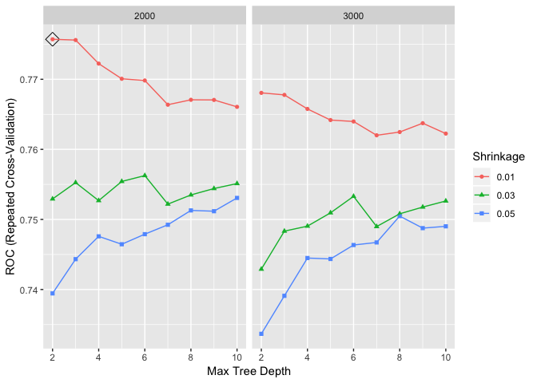<!-- -->

``` r
gbm_fit_1$results[which.max(gbm_fit_1$results$ROC),]
```

    ##   shrinkage interaction.depth n.minobsinnode n.trees      ROC      Sens
    ## 1      0.01                 2              1    2000 0.775709 0.8729232
    ##        Spec      ROCSD     SensSD     SpecSD
    ## 1 0.4590476 0.06380491 0.05331605 0.09311407

``` r
set.seed(12)

gbm_grid_2 <- expand.grid(n.trees = 2000,
                        interaction.depth = 2:8,
                        shrinkage = c(0.0008, 0.001, 0.004),
                        n.minobsinnode = 1)

gbm_fit_2 <- train(x = cog_train[3:10],
                 y = cog_train$cdr,
                 method = "gbm",
                 tuneGrid = gbm_grid_2,
                 trControl = ctrl1,
                 verbose = FALSE)
```

``` r
#Save and reload
#saveRDS(gbm_fit_2, file = "./data/gbm_fit_3.RDS")
gbm_fit_2 = readRDS("./data/gbm_fit_2.RDS")

ggplot(gbm_fit_2, highlight = TRUE) 
```

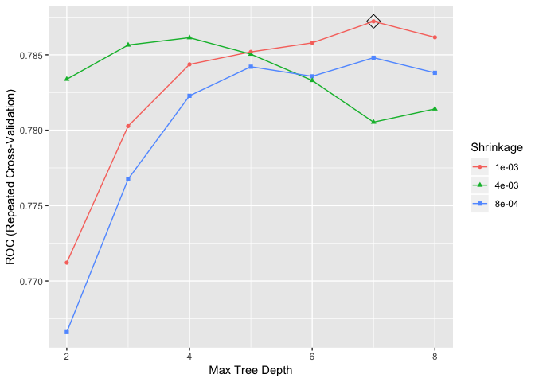<!-- -->

``` r
gbm_fit_2$results[which.max(gbm_fit_2$results$ROC),]
```

    ##    shrinkage interaction.depth n.minobsinnode n.trees       ROC      Sens
    ## 13     0.001                 7              1    2000 0.7872218 0.9214524
    ##         Spec      ROCSD     SensSD    SpecSD
    ## 13 0.3349524 0.05902025 0.04258906 0.1093456

``` r
set.seed(12)

gbm_grid_3 <- expand.grid(n.trees = c(2000, 5000),
                        interaction.depth = 4:10,
                        shrinkage = 0.001,
                        n.minobsinnode = 1)

gbm_fit_3 <- train(x = cog_train[3:10],
                 y = cog_train$cdr,
                 distribution = "bernoulli",
                 method = "gbm",
                 tuneGrid = gbm_grid_3,
                 trControl = ctrl1,
                 verbose = FALSE)
```

``` r
#Save and reload
#saveRDS(gbm_fit_3, file = "./data/gbm_fit_3.RDS")
gbm_fit_3 = readRDS("./data/gbm_fit_3.RDS")

ggplot(gbm_fit_3, highlight = TRUE) 
```

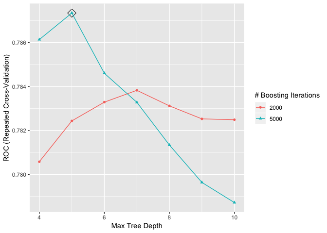<!-- -->

``` r
gbm_fit_3$results[which.max(gbm_fit_3$results$ROC),]
```

    ##   shrinkage interaction.depth n.minobsinnode n.trees       ROC      Sens
    ## 4     0.001                 5              1    5000 0.7873418 0.8941443
    ##        Spec      ROCSD     SensSD     SpecSD
    ## 4 0.4449048 0.05392645 0.04944103 0.09575783

``` r
## variable importance
summary.gbm(gbm_fit_3$finalModel)
```

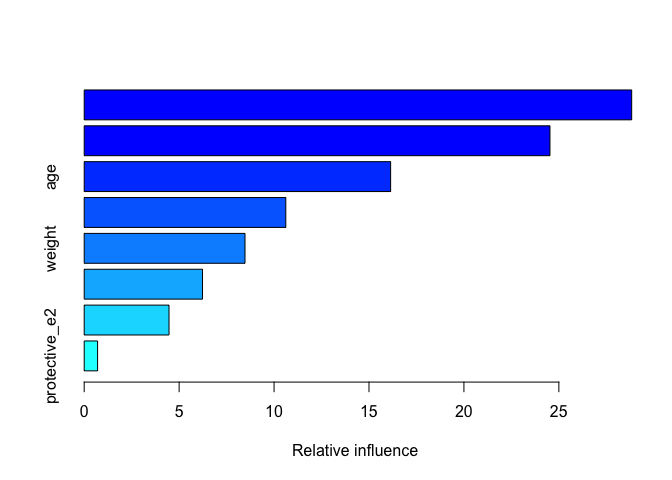<!-- -->

    ##                                                       var    rel.inf
    ## lh_cortex_vol                               lh_cortex_vol 28.8358871
    ## intra_cranial_vol                       intra_cranial_vol 24.5316186
    ## age                                                   age 16.1395290
    ## rh_cortical_white_matter_vol rh_cortical_white_matter_vol 10.6188727
    ## weight                                             weight  8.4694267
    ## risk_e4                                           risk_e4  6.2317954
    ## height                                             height  4.4673862
    ## protective_e2                               protective_e2  0.7054842

Test predictions, using gbm model 3:

``` r
##Test Predictions## 

pred_gbm_raw <- predict(gbm_fit_3, newdata = cog_test,
                    n.trees = 5000,
                    type = "raw")

confusionMatrix(data = pred_gbm_raw, 
                reference = cog_test$cdr,
                positive = "Dementia")
```

    ## Confusion Matrix and Statistics
    ## 
    ##              Reference
    ## Prediction    NonDementia Dementia
    ##   NonDementia         208       59
    ##   Dementia             23       42
    ##                                          
    ##                Accuracy : 0.753          
    ##                  95% CI : (0.703, 0.7985)
    ##     No Information Rate : 0.6958         
    ##     P-Value [Acc > NIR] : 0.012513       
    ##                                          
    ##                   Kappa : 0.3515         
    ##                                          
    ##  Mcnemar's Test P-Value : 0.000111       
    ##                                          
    ##             Sensitivity : 0.4158         
    ##             Specificity : 0.9004         
    ##          Pos Pred Value : 0.6462         
    ##          Neg Pred Value : 0.7790         
    ##              Prevalence : 0.3042         
    ##          Detection Rate : 0.1265         
    ##    Detection Prevalence : 0.1958         
    ##       Balanced Accuracy : 0.6581         
    ##                                          
    ##        'Positive' Class : Dementia       
    ## 

``` r
pred_gbm_prob <- predict(gbm_fit_3, newdata = cog_test,
                    n.trees = 5000,
                    type = "prob")

roc_gbm_test <- roc(cog_test$cdr, pred_gbm_prob$Dementia)

plot(roc_gbm_test, legacy.axes = TRUE, print.auc = TRUE) 
plot(smooth(roc_gbm_test), col = 4, add = TRUE) 
```

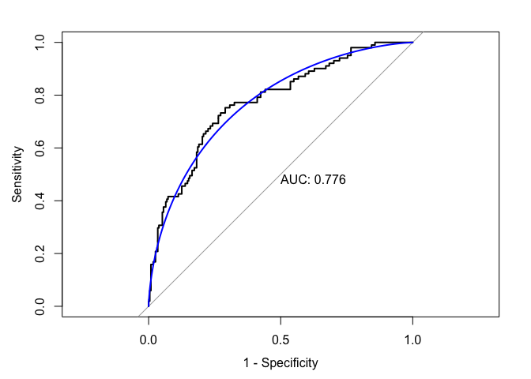<!-- -->

# xgboost

``` r
library(xgboost)
```

4.1 Step 1: Number of Iterations and the Learning Rate

``` r
set.seed(1)

nrounds <- 1000

tune_grid <- expand.grid(
  nrounds = seq(from = 200, to = nrounds, by = 50),
  eta = c(0.025, 0.05, 0.1, 0.3),
  max_depth = c(2, 3, 4, 5, 6),
  gamma = 0,
  colsample_bytree = 1,
  min_child_weight = 1,
  subsample = 1
)

tune_control <- caret::trainControl(
  method = "cv", # cross-validation
  number = 3, # with n folds
  #index = createFolds(tr_treated$Id_clean), # fix the folds
  verboseIter = FALSE, # no training log
  allowParallel = TRUE, # FALSE for reproducible results 
  summaryFunction = twoClassSummary, #because we're in the two-class setting
                     classProbs = TRUE
)

xgb_tune <- caret::train(
  cog_train[3:10],
  y = cog_train$cdr,
  metric = "ROC",
  trControl = tune_control,
  tuneGrid = tune_grid,
  method = "xgbTree",
  verbose = TRUE
)
```

    ## Warning: Setting row names on a tibble is deprecated.
    
    ## Warning: Setting row names on a tibble is deprecated.
    
    ## Warning: Setting row names on a tibble is deprecated.
    
    ## Warning: Setting row names on a tibble is deprecated.
    
    ## Warning: Setting row names on a tibble is deprecated.
    
    ## Warning: Setting row names on a tibble is deprecated.
    
    ## Warning: Setting row names on a tibble is deprecated.
    
    ## Warning: Setting row names on a tibble is deprecated.
    
    ## Warning: Setting row names on a tibble is deprecated.
    
    ## Warning: Setting row names on a tibble is deprecated.
    
    ## Warning: Setting row names on a tibble is deprecated.
    
    ## Warning: Setting row names on a tibble is deprecated.
    
    ## Warning: Setting row names on a tibble is deprecated.
    
    ## Warning: Setting row names on a tibble is deprecated.
    
    ## Warning: Setting row names on a tibble is deprecated.
    
    ## Warning: Setting row names on a tibble is deprecated.
    
    ## Warning: Setting row names on a tibble is deprecated.
    
    ## Warning: Setting row names on a tibble is deprecated.
    
    ## Warning: Setting row names on a tibble is deprecated.
    
    ## Warning: Setting row names on a tibble is deprecated.
    
    ## Warning: Setting row names on a tibble is deprecated.
    
    ## Warning: Setting row names on a tibble is deprecated.
    
    ## Warning: Setting row names on a tibble is deprecated.
    
    ## Warning: Setting row names on a tibble is deprecated.
    
    ## Warning: Setting row names on a tibble is deprecated.
    
    ## Warning: Setting row names on a tibble is deprecated.
    
    ## Warning: Setting row names on a tibble is deprecated.
    
    ## Warning: Setting row names on a tibble is deprecated.
    
    ## Warning: Setting row names on a tibble is deprecated.
    
    ## Warning: Setting row names on a tibble is deprecated.
    
    ## Warning: Setting row names on a tibble is deprecated.
    
    ## Warning: Setting row names on a tibble is deprecated.
    
    ## Warning: Setting row names on a tibble is deprecated.
    
    ## Warning: Setting row names on a tibble is deprecated.
    
    ## Warning: Setting row names on a tibble is deprecated.
    
    ## Warning: Setting row names on a tibble is deprecated.
    
    ## Warning: Setting row names on a tibble is deprecated.
    
    ## Warning: Setting row names on a tibble is deprecated.
    
    ## Warning: Setting row names on a tibble is deprecated.
    
    ## Warning: Setting row names on a tibble is deprecated.
    
    ## Warning: Setting row names on a tibble is deprecated.
    
    ## Warning: Setting row names on a tibble is deprecated.
    
    ## Warning: Setting row names on a tibble is deprecated.
    
    ## Warning: Setting row names on a tibble is deprecated.
    
    ## Warning: Setting row names on a tibble is deprecated.
    
    ## Warning: Setting row names on a tibble is deprecated.
    
    ## Warning: Setting row names on a tibble is deprecated.
    
    ## Warning: Setting row names on a tibble is deprecated.
    
    ## Warning: Setting row names on a tibble is deprecated.
    
    ## Warning: Setting row names on a tibble is deprecated.
    
    ## Warning: Setting row names on a tibble is deprecated.
    
    ## Warning: Setting row names on a tibble is deprecated.
    
    ## Warning: Setting row names on a tibble is deprecated.
    
    ## Warning: Setting row names on a tibble is deprecated.
    
    ## Warning: Setting row names on a tibble is deprecated.
    
    ## Warning: Setting row names on a tibble is deprecated.
    
    ## Warning: Setting row names on a tibble is deprecated.
    
    ## Warning: Setting row names on a tibble is deprecated.
    
    ## Warning: Setting row names on a tibble is deprecated.
    
    ## Warning: Setting row names on a tibble is deprecated.
    
    ## Warning: Setting row names on a tibble is deprecated.

``` r
# helper function for the plots
tuneplot <- function(x, probs = .30) {
  ggplot(x) +
    coord_cartesian(ylim = c(quantile(x$results$ROC, probs = probs), max(x$results$ROC))) +
    theme_bw()
}

tuneplot(xgb_tune)
```

<!-- -->

``` r
xgb_tune$bestTune
```

    ##    nrounds max_depth  eta gamma colsample_bytree min_child_weight
    ## 87     250         2 0.05     0                1                1
    ##    subsample
    ## 87         1

``` r
xgb_tune$results[which.max(xgb_tune$results$ROC),]
```

    ##     eta max_depth gamma colsample_bytree min_child_weight subsample
    ## 87 0.05         2     0                1                1         1
    ##    nrounds       ROC      Sens      Spec      ROCSD    SensSD     SpecSD
    ## 87     250 0.7764736 0.8877391 0.4307141 0.04553338 0.0409877 0.01537115

4.2 Step 2: Maximum Depth and Minimum Child Weight After fixing the
learning rate to 0.05 and we’ll also set maximum depth to 3 +-1 (or +2
if max\_depth == 2) to experiment a bit around the suggested best tune
in previous step. Then, well fix maximum depth and minimum child weight:

``` r
set.seed(1)

tune_grid2 <- expand.grid(
  nrounds = seq(from = 50, to = nrounds, by = 50),
  eta = xgb_tune$bestTune$eta,
  max_depth = ifelse(xgb_tune$bestTune$max_depth == 2,
    c(xgb_tune$bestTune$max_depth:4),
    xgb_tune$bestTune$max_depth - 1:xgb_tune$bestTune$max_depth + 1),
  gamma = 0,
  colsample_bytree = 1,
  min_child_weight = c(1, 2, 3),
  subsample = 1
)

xgb_tune2 <- caret::train(
  x = cog_train[3:10],
  y = cog_train$cdr,
  metric = "ROC",
  trControl = tune_control,
  tuneGrid = tune_grid2,
  method = "xgbTree",
  verbose = TRUE
)
```

    ## Warning: Setting row names on a tibble is deprecated.
    
    ## Warning: Setting row names on a tibble is deprecated.
    
    ## Warning: Setting row names on a tibble is deprecated.
    
    ## Warning: Setting row names on a tibble is deprecated.
    
    ## Warning: Setting row names on a tibble is deprecated.
    
    ## Warning: Setting row names on a tibble is deprecated.
    
    ## Warning: Setting row names on a tibble is deprecated.
    
    ## Warning: Setting row names on a tibble is deprecated.
    
    ## Warning: Setting row names on a tibble is deprecated.
    
    ## Warning: Setting row names on a tibble is deprecated.

``` r
tuneplot(xgb_tune2)
```

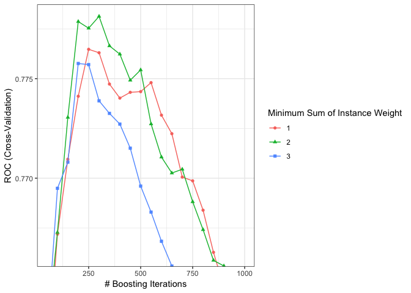<!-- -->

``` r
xgb_tune2$bestTune
```

    ##    nrounds max_depth  eta gamma colsample_bytree min_child_weight
    ## 26     300         2 0.05     0                1                2
    ##    subsample
    ## 26         1

``` r
xgb_tune2$results[which.max(xgb_tune2$results$ROC),]
```

    ##     eta max_depth gamma colsample_bytree min_child_weight subsample
    ## 26 0.05         2     0                1                2         1
    ##    nrounds       ROC      Sens      Spec      ROCSD     SensSD     SpecSD
    ## 26     300 0.7781286 0.8877531 0.4506146 0.04221574 0.04141497 0.02090931

4.3 Step 3: Column and Row Sampling Based on this, we can fix minimum
child weight to 2 and maximum depth to 2. Next, we’ll try different
values for row and column sampling:

``` r
set.seed(1)

tune_grid3 <- expand.grid(
  nrounds = seq(from = 50, to = nrounds, by = 50),
  eta = xgb_tune$bestTune$eta,
  max_depth = xgb_tune2$bestTune$max_depth,
  gamma = 0,
  colsample_bytree = c(0.4, 0.6, 0.8, 1.0),
  min_child_weight = xgb_tune2$bestTune$min_child_weight,
  subsample = c(0.5, 0.75, 1.0)
)

xgb_tune3 <- caret::train(
  x = cog_train[3:10],
  y = cog_train$cdr,
  metric = "ROC",
  trControl = tune_control,
  tuneGrid = tune_grid3,
  method = "xgbTree",
  verbose = TRUE
)
```

    ## Warning: Setting row names on a tibble is deprecated.
    
    ## Warning: Setting row names on a tibble is deprecated.
    
    ## Warning: Setting row names on a tibble is deprecated.
    
    ## Warning: Setting row names on a tibble is deprecated.
    
    ## Warning: Setting row names on a tibble is deprecated.
    
    ## Warning: Setting row names on a tibble is deprecated.
    
    ## Warning: Setting row names on a tibble is deprecated.
    
    ## Warning: Setting row names on a tibble is deprecated.
    
    ## Warning: Setting row names on a tibble is deprecated.
    
    ## Warning: Setting row names on a tibble is deprecated.
    
    ## Warning: Setting row names on a tibble is deprecated.
    
    ## Warning: Setting row names on a tibble is deprecated.
    
    ## Warning: Setting row names on a tibble is deprecated.
    
    ## Warning: Setting row names on a tibble is deprecated.
    
    ## Warning: Setting row names on a tibble is deprecated.
    
    ## Warning: Setting row names on a tibble is deprecated.
    
    ## Warning: Setting row names on a tibble is deprecated.
    
    ## Warning: Setting row names on a tibble is deprecated.
    
    ## Warning: Setting row names on a tibble is deprecated.
    
    ## Warning: Setting row names on a tibble is deprecated.
    
    ## Warning: Setting row names on a tibble is deprecated.
    
    ## Warning: Setting row names on a tibble is deprecated.
    
    ## Warning: Setting row names on a tibble is deprecated.
    
    ## Warning: Setting row names on a tibble is deprecated.
    
    ## Warning: Setting row names on a tibble is deprecated.
    
    ## Warning: Setting row names on a tibble is deprecated.
    
    ## Warning: Setting row names on a tibble is deprecated.
    
    ## Warning: Setting row names on a tibble is deprecated.
    
    ## Warning: Setting row names on a tibble is deprecated.
    
    ## Warning: Setting row names on a tibble is deprecated.
    
    ## Warning: Setting row names on a tibble is deprecated.
    
    ## Warning: Setting row names on a tibble is deprecated.
    
    ## Warning: Setting row names on a tibble is deprecated.
    
    ## Warning: Setting row names on a tibble is deprecated.
    
    ## Warning: Setting row names on a tibble is deprecated.
    
    ## Warning: Setting row names on a tibble is deprecated.
    
    ## Warning: Setting row names on a tibble is deprecated.

``` r
tuneplot(xgb_tune3, probs = .5)
```

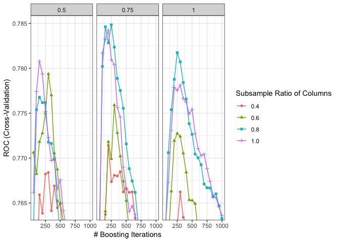<!-- -->

``` r
xgb_tune3$bestTune
```

    ##     nrounds max_depth  eta gamma colsample_bytree min_child_weight
    ## 145     250         2 0.05     0              0.8                2
    ##     subsample
    ## 145      0.75

``` r
xgb_tune3$results[which.max(xgb_tune3$results$ROC),]
```

    ##      eta max_depth gamma colsample_bytree min_child_weight subsample
    ## 145 0.05         2     0              0.8                2      0.75
    ##     nrounds       ROC      Sens      Spec      ROCSD     SensSD     SpecSD
    ## 145     250 0.7848385 0.8813015 0.4206907 0.04569922 0.04171376 0.01924689

4.4 Step 4: Gamma Next, we again pick the best values from previous
step, and now will see whether changing the gamma has any effect on the
model fit:

``` r
set.seed(1)
tune_grid4 <- expand.grid(
  nrounds = seq(from = 50, to = nrounds, by = 50),
  eta = xgb_tune$bestTune$eta,
  max_depth = xgb_tune2$bestTune$max_depth,
  gamma = c(0, 0.05, 0.1, 0.5, 0.7, 0.9, 1.0),
  colsample_bytree = xgb_tune3$bestTune$colsample_bytree,
  min_child_weight = xgb_tune2$bestTune$min_child_weight,
  subsample = xgb_tune3$bestTune$subsample
)

xgb_tune4 <- caret::train(
  x = cog_train[3:10],
  y = cog_train$cdr,
  metric = "ROC",
  trControl = tune_control,
  tuneGrid = tune_grid4,
  method = "xgbTree",
  verbose = TRUE
)
```

    ## Warning: Setting row names on a tibble is deprecated.
    
    ## Warning: Setting row names on a tibble is deprecated.
    
    ## Warning: Setting row names on a tibble is deprecated.
    
    ## Warning: Setting row names on a tibble is deprecated.
    
    ## Warning: Setting row names on a tibble is deprecated.
    
    ## Warning: Setting row names on a tibble is deprecated.
    
    ## Warning: Setting row names on a tibble is deprecated.
    
    ## Warning: Setting row names on a tibble is deprecated.
    
    ## Warning: Setting row names on a tibble is deprecated.
    
    ## Warning: Setting row names on a tibble is deprecated.
    
    ## Warning: Setting row names on a tibble is deprecated.
    
    ## Warning: Setting row names on a tibble is deprecated.
    
    ## Warning: Setting row names on a tibble is deprecated.
    
    ## Warning: Setting row names on a tibble is deprecated.
    
    ## Warning: Setting row names on a tibble is deprecated.
    
    ## Warning: Setting row names on a tibble is deprecated.
    
    ## Warning: Setting row names on a tibble is deprecated.
    
    ## Warning: Setting row names on a tibble is deprecated.
    
    ## Warning: Setting row names on a tibble is deprecated.
    
    ## Warning: Setting row names on a tibble is deprecated.
    
    ## Warning: Setting row names on a tibble is deprecated.
    
    ## Warning: Setting row names on a tibble is deprecated.

``` r
tuneplot(xgb_tune4)
```

    ## Warning: The shape palette can deal with a maximum of 6 discrete values
    ## because more than 6 becomes difficult to discriminate; you have 7.
    ## Consider specifying shapes manually if you must have them.

    ## Warning: Removed 20 rows containing missing values (geom_point).

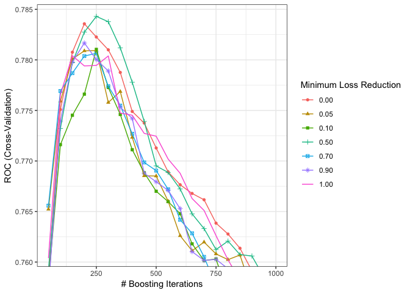<!-- -->

``` r
xgb_tune4$results[which.max(xgb_tune4$results$ROC),]
```

    ##     eta max_depth gamma colsample_bytree min_child_weight subsample
    ## 65 0.05         2   0.5              0.8                2      0.75
    ##    nrounds       ROC      Sens      Spec      ROCSD     SensSD     SpecSD
    ## 65     250 0.7843025 0.8769865 0.4307141 0.04954639 0.04491103 0.01537115

4.5 Step 5: Reducing the Learning Rate

``` r
set.seed(1)

tune_grid5 <- expand.grid(
  nrounds = seq(from = 100, to = 10000, by = 100),
  eta = c(0.01, 0.015, 0.025, 0.05, 0.1),
  max_depth = xgb_tune2$bestTune$max_depth,
  gamma = xgb_tune4$bestTune$gamma,
  colsample_bytree = xgb_tune3$bestTune$colsample_bytree,
  min_child_weight = xgb_tune2$bestTune$min_child_weight,
  subsample = xgb_tune3$bestTune$subsample
)

xgb_tune5 <- caret::train(
  x = cog_train[3:10],
  y = cog_train$cdr,
  metric = "ROC",
  trControl = tune_control,
  tuneGrid = tune_grid5,
  method = "xgbTree",
  verbose = TRUE
)
```

    ## Warning: Setting row names on a tibble is deprecated.
    
    ## Warning: Setting row names on a tibble is deprecated.
    
    ## Warning: Setting row names on a tibble is deprecated.
    
    ## Warning: Setting row names on a tibble is deprecated.
    
    ## Warning: Setting row names on a tibble is deprecated.
    
    ## Warning: Setting row names on a tibble is deprecated.
    
    ## Warning: Setting row names on a tibble is deprecated.
    
    ## Warning: Setting row names on a tibble is deprecated.
    
    ## Warning: Setting row names on a tibble is deprecated.
    
    ## Warning: Setting row names on a tibble is deprecated.
    
    ## Warning: Setting row names on a tibble is deprecated.
    
    ## Warning: Setting row names on a tibble is deprecated.
    
    ## Warning: Setting row names on a tibble is deprecated.
    
    ## Warning: Setting row names on a tibble is deprecated.
    
    ## Warning: Setting row names on a tibble is deprecated.
    
    ## Warning: Setting row names on a tibble is deprecated.

``` r
tuneplot(xgb_tune5)
```

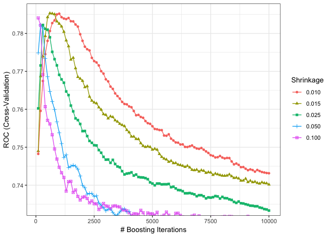<!-- -->

``` r
xgb_tune5$results[which.max(xgb_tune5$results$ROC),]
```

    ##       eta max_depth gamma colsample_bytree min_child_weight subsample
    ## 106 0.015         2   0.5              0.8                2      0.75
    ##     nrounds       ROC     Sens      Spec      ROCSD     SensSD     SpecSD
    ## 106     600 0.7853111 0.892124 0.4010097 0.05400295 0.05153976 0.01531253

Final grid:

``` r
ctrl1 <- trainControl(method = "repeatedcv",
                     repeats = 5,
                     summaryFunction = twoClassSummary,
                     classProbs = TRUE) #because need predicted class probabilities to get ROC curve

final_grid <- expand.grid(
  nrounds = xgb_tune5$bestTune$nrounds,
  eta = xgb_tune5$bestTune$eta,
  max_depth = xgb_tune5$bestTune$max_depth,
  gamma = xgb_tune5$bestTune$gamma,
  colsample_bytree = xgb_tune5$bestTune$colsample_bytree,
  min_child_weight = xgb_tune5$bestTune$min_child_weight,
  subsample = xgb_tune5$bestTune$subsample)

final_xbg = caret::train(
 x = cog_train[3:10],
  y = cog_train$cdr,
   metric = "ROC",
  trControl = ctrl1,
  tuneGrid = final_grid,
  method = "xgbTree",
  verbose = TRUE
)

final_xbg

saveRDS(final_xbg, "./data/xgboost.RDS")
```

\#xg boost test pred

``` r
final_xbg = readRDS("./data/xgboost.RDS")

#model prediction on test data
xgbpred <- predict(final_xbg, cog_test)

confusionMatrix(xgbpred, reference = cog_test$cdr)
```

    ## Confusion Matrix and Statistics
    ## 
    ##              Reference
    ## Prediction    NonDementia Dementia
    ##   NonDementia         211       60
    ##   Dementia             20       41
    ##                                           
    ##                Accuracy : 0.759           
    ##                  95% CI : (0.7093, 0.8041)
    ##     No Information Rate : 0.6958          
    ##     P-Value [Acc > NIR] : 0.006388        
    ##                                           
    ##                   Kappa : 0.3594          
    ##                                           
    ##  Mcnemar's Test P-Value : 1.299e-05       
    ##                                           
    ##             Sensitivity : 0.9134          
    ##             Specificity : 0.4059          
    ##          Pos Pred Value : 0.7786          
    ##          Neg Pred Value : 0.6721          
    ##              Prevalence : 0.6958          
    ##          Detection Rate : 0.6355          
    ##    Detection Prevalence : 0.8163          
    ##       Balanced Accuracy : 0.6597          
    ##                                           
    ##        'Positive' Class : NonDementia     
    ## 

``` r
#roc test
xgbpred_prob <- predict(final_xbg, cog_test, type = "prob")

roc_xboost_test <- roc(cog_test$cdr, xgbpred_prob$Dementia)

plot(roc_xboost_test, legacy.axes = TRUE, print.auc = TRUE) 
plot(smooth(roc_xboost_test), col = 4, add = TRUE) 
```

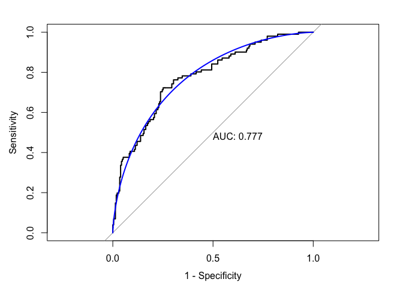<!-- -->

``` r
#roc train
xgbpred_train_prob <- predict(final_xbg, cog_train, type = "prob")
roc_xboost_train <- roc(cog_train$cdr, xgbpred_train_prob$Dementia)
plot(roc_xboost_train, legacy.axes = TRUE, print.auc = TRUE) 
plot(smooth(roc_xboost_train), col = 4, add = TRUE) 
```

<!-- -->

``` r
#importance
mat <- xgb.importance(feature_names = colnames(cog_train[3:10]),
                      model = final_xbg$finalModel)
xgb.plot.importance(importance_matrix = mat) 
```

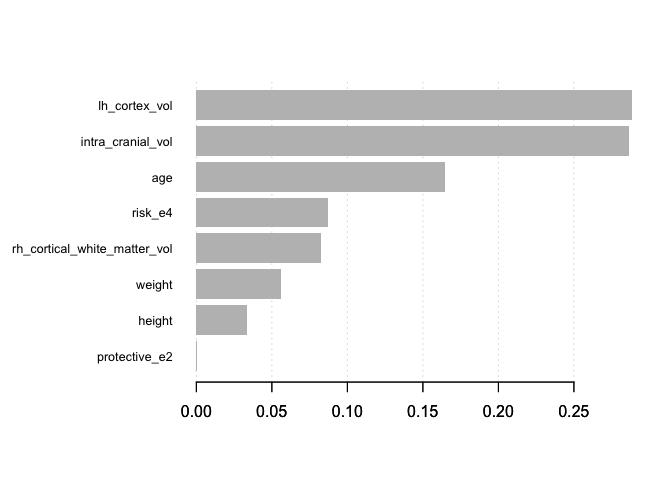<!-- -->

# resamples

``` r
library(caret)

gbm_fit = readRDS("./data/gbm_fit_3.RDS")
xgb_fit = readRDS("./data/xgboost.RDS")
svm_fit = readRDS("./data/SVM.RDS")
rf_fit = readRDS("./data/rf.fit.RDS")
knn_fit = readRDS("./data/knn.RDS")
nb_fit  = readRDS("./data/nb.RDS")
logit_fit  = readRDS("./data/logit.RDS")
lda_fit = readRDS("./data/lda.RDS")
cart_fit = readRDS("./data/cart.RDS")

set.seed(2)
resamp <- resamples(list(xgboost = xgb_fit,
                         gbm = gbm_fit,
                        svm = svm_fit,
                         rf = rf_fit,
                         knn = knn_fit,
                         nb = nb_fit,
                         logistic = logit_fit,
                         lda = lda_fit, 
                         cart = cart_fit))
bwplot(resamp)
```

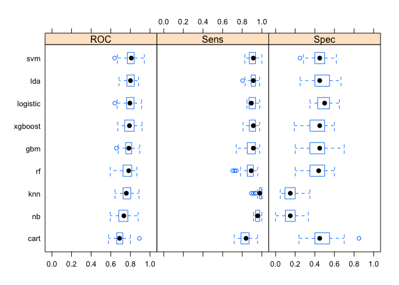<!-- -->

``` r
ggplot(resamp)
```

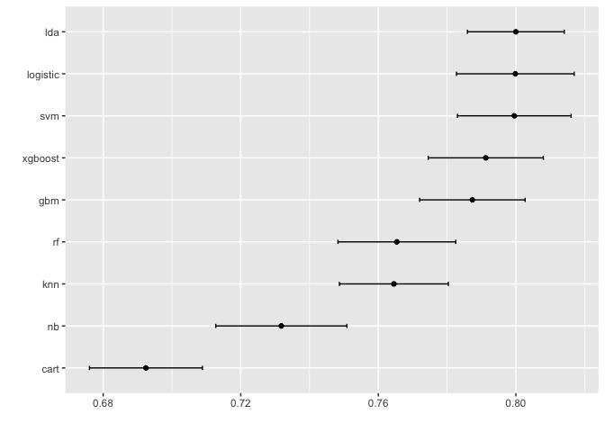<!-- -->

``` r
summary(resamp)
```

    ## 
    ## Call:
    ## summary.resamples(object = resamp)
    ## 
    ## Models: xgboost, gbm, svm, rf, knn, nb, logistic, lda, cart 
    ## Number of resamples: 50 
    ## 
    ## ROC 
    ##               Min.   1st Qu.    Median      Mean   3rd Qu.      Max. NA's
    ## xgboost  0.6712766 0.7437500 0.7900362 0.7912418 0.8371151 0.9180851    0
    ## gbm      0.6565217 0.7541149 0.7840426 0.7873418 0.8127717 0.8945652    0
    ## svm      0.6391304 0.7690217 0.8090426 0.7995225 0.8378585 0.9420290    0
    ## rf       0.5952381 0.7281337 0.7820652 0.7653794 0.8130809 0.8663043    0
    ## knn      0.6423913 0.7260870 0.7583372 0.7645090 0.8029382 0.8877660    0
    ## nb       0.5936170 0.6842391 0.7331522 0.7318003 0.7739130 0.8797872    0
    ## logistic 0.6403242 0.7613437 0.7947981 0.7998271 0.8369565 0.9148936    0
    ## lda      0.6826087 0.7653339 0.8006470 0.7999751 0.8382979 0.8840580    0
    ## cart     0.5760870 0.6615815 0.6895120 0.6924352 0.7199728 0.8923913    0
    ## 
    ## Sens 
    ##               Min.   1st Qu.    Median      Mean   3rd Qu.      Max. NA's
    ## xgboost  0.8085106 0.8770814 0.9130435 0.9050139 0.9347826 0.9787234    0
    ## gbm      0.7391304 0.8556892 0.9130435 0.8941443 0.9347826 0.9782609    0
    ## svm      0.8260870 0.8770814 0.9130435 0.9109898 0.9361702 1.0000000    0
    ## rf       0.7021277 0.8510638 0.8913043 0.8761055 0.9130435 0.9574468    0
    ## knn      0.8936170 0.9782609 0.9782609 0.9766975 1.0000000 1.0000000    0
    ## nb       0.9148936 0.9412581 0.9569843 0.9632932 0.9787234 1.0000000    0
    ## logistic 0.8478261 0.8695652 0.8936170 0.9041351 0.9347826 0.9787234    0
    ## lda      0.8043478 0.8913043 0.9130435 0.9079741 0.9347826 0.9787234    0
    ## cart     0.7173913 0.7915125 0.8388067 0.8359389 0.8695652 0.9565217    0
    ## 
    ## Spec 
    ##                Min.   1st Qu.    Median      Mean   3rd Qu.      Max. NA's
    ## xgboost  0.19047619 0.3577381 0.4500000 0.4405714 0.5000000 0.6000000    0
    ## gbm      0.20000000 0.3577381 0.4500000 0.4449048 0.5000000 0.7000000    0
    ## svm      0.25000000 0.4000000 0.4500000 0.4545714 0.5000000 0.6190476    0
    ## rf       0.20000000 0.3500000 0.4392857 0.4218095 0.5000000 0.6000000    0
    ## knn      0.04761905 0.0952381 0.1500000 0.1489524 0.2000000 0.3500000    0
    ## nb       0.00000000 0.1000000 0.1500000 0.1490476 0.2000000 0.3333333    0
    ## logistic 0.35000000 0.4285714 0.5000000 0.4899524 0.5500000 0.6500000    0
    ## lda      0.25000000 0.4000000 0.4500000 0.4672381 0.5500000 0.6666667    0
    ## cart     0.23809524 0.4000000 0.4500000 0.4596190 0.5434524 0.8500000    0
