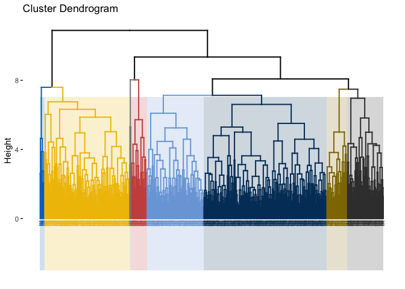
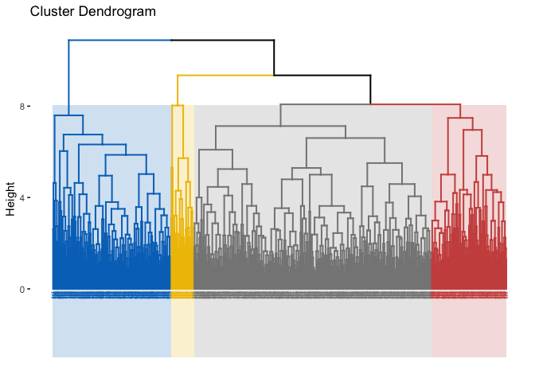

Hierarchical Clusters
================

``` r
library(tidyverse)
```

    ## ── Attaching packages ────────── tidyverse 1.2.1 ──

    ## ✔ ggplot2 3.1.0       ✔ purrr   0.2.5  
    ## ✔ tibble  2.1.1       ✔ dplyr   0.8.0.1
    ## ✔ tidyr   0.8.2       ✔ stringr 1.3.1  
    ## ✔ readr   1.3.1       ✔ forcats 0.4.0

    ## ── Conflicts ───────────── tidyverse_conflicts() ──
    ## ✖ dplyr::filter() masks stats::filter()
    ## ✖ dplyr::lag()    masks stats::lag()

``` r
library(ISLR)
library(factoextra)
```

    ## Welcome! Related Books: `Practical Guide To Cluster Analysis in R` at https://goo.gl/13EFCZ

``` r
library(FunCluster)
```

    ## Loading required package: Hmisc

    ## Loading required package: lattice

    ## Loading required package: survival

    ## Loading required package: Formula

    ## 
    ## Attaching package: 'Hmisc'

    ## The following objects are masked from 'package:dplyr':
    ## 
    ##     src, summarize

    ## The following objects are masked from 'package:base':
    ## 
    ##     format.pval, units

    ## Loading required package: cluster

    ## 
    ## Attaching package: 'FunCluster'

    ## The following object is masked from 'package:ggplot2':
    ## 
    ##     annotate

``` r
library(RColorBrewer)
library(gplots)
```

    ## 
    ## Attaching package: 'gplots'

    ## The following object is masked from 'package:stats':
    ## 
    ##     lowess

``` r
cog_data <- readRDS("./data/cog_data_preproc.RDS")
cog_train <- readRDS("./data/cog_train_preproc.RDS")
cog_test <- readRDS("./data/cog_test_preproc.RDS")

cog_data <- readRDS("./data/cog_data_preproc.RDS") %>%
  dplyr::select(-subject) %>% 
  na.omit() # omit rows with NA

set.seed(1)

sd.data <- scale(cog_data[, -1])

hc.complete <- hclust(dist(sd.data), method = "complete")

fviz_nbclust(cog_data[, -1],
             FUNcluster = hcut,
             k.max = 15,
             method = "gap",
             print.summary = TRUE)
```


``` r
#8 clusters
fviz_dend(hc.complete, k = 8,
          cex = 0.3,
          palette = "jco",
          color_labels_by_k = TRUE,
          rect = TRUE, rect_fill = TRUE, rect_border = "jco",
          labels_track_height = 2.5)
```



``` r
#4 clusters
fviz_dend(hc.complete, k = 4,
          cex = 0.3,
          palette = "jco",
          color_labels_by_k = TRUE,
          rect = TRUE, rect_fill = TRUE, rect_border = "jco",
          labels_track_height = 2.5)
```



``` r
set.seed(1)
hc.complete.cut <- cutree(hc.complete, 4)

#cluster 1
cog_train[3:10][hc.complete.cut == 1,]
```

    ## Warning: Length of logical index must be 1 or 665, not 913

    ## # A tibble: 151 x 8
    ##        age protective_e2 risk_e4 height weight intra_cranial_v…
    ##      <dbl>         <dbl>   <dbl>  <dbl>  <dbl>            <dbl>
    ##  1  0.158          2.11   -0.763 -0.757  0.445           -1.69 
    ##  2 -0.915          2.11   -0.763 -0.757  0.933           -0.280
    ##  3  0.459         -0.407  -0.763  1.31   2.32             2.24 
    ##  4  1.35          -0.407  -0.763  0.792  2.05             0.178
    ##  5 -0.0223         2.11   -0.763  2.34   2.13             1.56 
    ##  6  0.0570        -0.407  -0.763  1.31   0.391            0.873
    ##  7  0.405         -0.407  -0.763 -1.02  -0.233            0.483
    ##  8  1.16           2.11    0.912 -1.79  -0.993           -0.396
    ##  9 -1.05           2.11    0.912  0.275 -0.505           -0.606
    ## 10  0.604          2.11   -0.763  1.05   1.77             0.452
    ## # … with 141 more rows, and 2 more variables: lh_cortex_vol <dbl>,
    ## #   rh_cortical_white_matter_vol <dbl>

``` r
#cluster 2
cog_train[3:10][hc.complete.cut == 2,]
```

    ## Warning: Length of logical index must be 1 or 665, not 913

    ## # A tibble: 238 x 8
    ##        age protective_e2 risk_e4  height  weight intra_cranial_v…
    ##      <dbl>         <dbl>   <dbl>   <dbl>   <dbl>            <dbl>
    ##  1  0.0574        -0.407   0.912 -0.757  -0.478             1.08 
    ##  2  0.413          2.11    0.912  0.275   0.363             0.597
    ##  3  1.76          -0.407  -0.763  0.0173 -0.939             2.28 
    ##  4  0.0375        -0.407   0.912  0.0173 -0.0164            0.329
    ##  5 -2.23          -0.407   2.59  -0.292  -0.885            -0.594
    ##  6 -0.198         -0.407  -0.763 -1.02   -1.13             -0.615
    ##  7  1.04          -0.407  -0.763  0.533  -0.0707            0.797
    ##  8  0.0590        -0.407   0.912 -1.27   -0.668            -0.197
    ##  9  0.948         -0.407  -0.763 -1.27   -1.97             -0.706
    ## 10 -0.429         -0.407   2.59  -0.757  -0.939            -0.161
    ## # … with 228 more rows, and 2 more variables: lh_cortex_vol <dbl>,
    ## #   rh_cortical_white_matter_vol <dbl>

``` r
#cluster 3
cog_train[3:10][hc.complete.cut == 3,]
```

    ## Warning: Length of logical index must be 1 or 665, not 913

    ## # A tibble: 478 x 8
    ##        age protective_e2 risk_e4 height weight intra_cranial_v…
    ##      <dbl>         <dbl>   <dbl>  <dbl>  <dbl>            <dbl>
    ##  1 -0.416         -0.407  -0.763  0.275 -0.233         -0.591  
    ##  2 -1.67          -0.407  -0.763 -1.02   0.255         -0.00800
    ##  3 -1.53          -0.407  -0.763 -0.757 -0.776         -0.623  
    ##  4 -0.176         -0.407  -0.763 -0.757 -0.613          0.762  
    ##  5  0.425         -0.407   0.912 -2.82  -2.16          -0.502  
    ##  6  0.0360        -0.407   0.912 -0.499  0.201          0.0939 
    ##  7 -0.0319        -0.407   0.912  0.275 -0.586          1.67   
    ##  8 -0.663         -0.407  -0.763  0.275  0.255          0.639  
    ##  9  0.904         -0.407  -0.763 -1.02  -1.81           0.746  
    ## 10  1.04          -0.407  -0.763 -1.02  -0.396         -0.535  
    ## # … with 468 more rows, and 2 more variables: lh_cortex_vol <dbl>,
    ## #   rh_cortical_white_matter_vol <dbl>

``` r
#cluster 4
cog_train[3:10][hc.complete.cut == 4,]
```

    ## Warning: Length of logical index must be 1 or 665, not 913

    ## # A tibble: 46 x 8
    ##        age protective_e2 risk_e4  height  weight intra_cranial_v…
    ##      <dbl>         <dbl>   <dbl>   <dbl>   <dbl>            <dbl>
    ##  1 -0.0585        -0.407  -0.763 -0.241  -1.45             -0.471
    ##  2  1.22          -0.407  -0.763 -1.27   -0.966            -1.47 
    ##  3 -0.390         -0.407  -0.763  0.275  -0.179             0.360
    ##  4  1.50          -0.407   0.912  0.0173 -0.288             1.68 
    ##  5 -1.06           2.11   -0.763  1.31    1.26              1.48 
    ##  6  0.476         -0.407   0.912 -0.241  -0.261            -0.502
    ##  7  0.582         -0.407  -0.763 -0.499  -0.0707            0.426
    ##  8 -0.507         -0.407   0.912 -1.79   -1.67              1.12 
    ##  9  1.15          -0.407   0.912  0.533  -0.478            -1.75 
    ## 10  1.49          -0.407  -0.763 -0.757  -0.478             0.482
    ## # … with 36 more rows, and 2 more variables: lh_cortex_vol <dbl>,
    ## #   rh_cortical_white_matter_vol <dbl>

``` r
col1 <- colorRampPalette(brewer.pal(9, "GnBu"))(100)

heatmap.2(t(sd.data),
          col = col1, keysize = .8, key.par = list(cex = .5),
          trace = "none", key = TRUE, cexCol = 0.75,
          labCol = as.character(cog_data[,1]),
          margins = c(10, 10))
```


