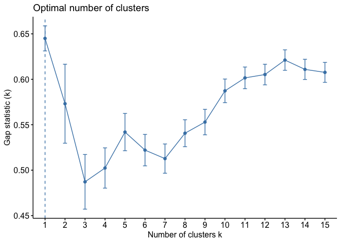

Hierarchical Clusters
================

``` r
library(ISLR)
library(factoextra)
```

    ## Loading required package: ggplot2

    ## Welcome! Related Books: `Practical Guide To Cluster Analysis in R` at https://goo.gl/13EFCZ

``` r
library(RColorBrewer)
library(gplots)
```

    ## 
    ## Attaching package: 'gplots'

    ## The following object is masked from 'package:stats':
    ## 
    ##     lowess

``` r
cog_data <- readRDS("./data/cog_data_preproc.RDS")
cog_train <- readRDS("./data/cog_train_preproc.RDS")
cog_test <- readRDS("./data/cog_test_preproc.RDS")

set.seed(1)

sd.data <- scale(cog_train[3:10])

hc.complete <- hclust(dist(sd.data), method = "complete")

#8 clusters
fviz_dend(hc.complete, k = 8,
          cex = 0.3,
          palette = "jco",
          color_labels_by_k = TRUE,
          rect = TRUE, rect_fill = TRUE, rect_border = "jco",
          labels_track_height = 2.5)
```



``` r
#4 clusters
fviz_dend(hc.complete, k = 4,
          cex = 0.3,
          palette = "jco",
          color_labels_by_k = TRUE,
          rect = TRUE, rect_fill = TRUE, rect_border = "jco",
          labels_track_height = 2.5)
```


``` r
set.seed(1)
hc.complete.cut <- cutree(hc.complete, 4)

#cluster 1
cog_train[3:10][hc.complete.cut == 1,]
```

    ## # A tibble: 38 x 8
    ##        age protective_e2 risk_e4 height weight intra_cranial_v…
    ##      <dbl>         <dbl>   <dbl>  <dbl>  <dbl>            <dbl>
    ##  1  0.158           2.11  -0.763 -0.757  0.445           -1.69 
    ##  2 -0.915           2.11  -0.763 -0.757  0.933           -0.280
    ##  3  0.413           2.11   0.912  0.275  0.363            0.597
    ##  4 -0.710           2.11  -0.763 -1.02  -1.05            -0.973
    ##  5 -1.36            4.64  -0.763 -1.27  -0.478           -2.06 
    ##  6 -1.05            2.11   0.912  0.275 -0.505           -0.606
    ##  7 -0.562           2.11  -0.763 -0.499 -0.640           -1.19 
    ##  8 -1.20            2.11  -0.763 -0.499 -0.912           -1.63 
    ##  9  0.0831          4.64  -0.763  1.31   3.24             0.398
    ## 10 -0.340           4.64  -0.763  1.82   1.07            -0.140
    ## # … with 28 more rows, and 2 more variables: lh_cortex_vol <dbl>,
    ## #   rh_cortical_white_matter_vol <dbl>

``` r
#cluster 2
cog_train[3:10][hc.complete.cut == 2,]
```

    ## # A tibble: 365 x 8
    ##        age protective_e2 risk_e4  height  weight intra_cranial_v…
    ##      <dbl>         <dbl>   <dbl>   <dbl>   <dbl>            <dbl>
    ##  1  0.0574        -0.407   0.912 -0.757  -0.478           1.08   
    ##  2 -0.416         -0.407  -0.763  0.275  -0.233          -0.591  
    ##  3 -1.67          -0.407  -0.763 -1.02    0.255          -0.00800
    ##  4 -1.53          -0.407  -0.763 -0.757  -0.776          -0.623  
    ##  5  1.76          -0.407  -0.763  0.0173 -0.939           2.28   
    ##  6 -0.176         -0.407  -0.763 -0.757  -0.613           0.762  
    ##  7  0.0375        -0.407   0.912  0.0173 -0.0164          0.329  
    ##  8 -2.23          -0.407   2.59  -0.292  -0.885          -0.594  
    ##  9 -0.198         -0.407  -0.763 -1.02   -1.13           -0.615  
    ## 10  1.04          -0.407  -0.763  0.533  -0.0707          0.797  
    ## # … with 355 more rows, and 2 more variables: lh_cortex_vol <dbl>,
    ## #   rh_cortical_white_matter_vol <dbl>

``` r
#cluster 3
cog_train[3:10][hc.complete.cut == 3,]
```

    ## # A tibble: 118 x 8
    ##        age protective_e2 risk_e4 height weight intra_cranial_v…
    ##      <dbl>         <dbl>   <dbl>  <dbl>  <dbl>            <dbl>
    ##  1  0.459         -0.407  -0.763 1.31    2.32             2.24 
    ##  2 -0.663         -0.407  -0.763 0.275   0.255            0.639
    ##  3  0.373          2.11   -0.763 1.57    0.580            1.06 
    ##  4 -0.0656        -0.407   0.912 1.05    1.10             1.72 
    ##  5 -0.0223         2.11   -0.763 2.34    2.13             1.56 
    ##  6  0.0570        -0.407  -0.763 1.31    0.391            0.873
    ##  7  0.765         -0.407  -0.763 0.792   1.29             1.11 
    ##  8 -0.237         -0.407   0.912 0.0173  1.29             0.586
    ##  9  0.604          2.11   -0.763 1.05    1.77             0.452
    ## 10 -0.703         -0.407  -0.763 2.08    1.72             1.71 
    ## # … with 108 more rows, and 2 more variables: lh_cortex_vol <dbl>,
    ## #   rh_cortical_white_matter_vol <dbl>

``` r
#cluster 4
cog_train[3:10][hc.complete.cut == 4,]
```

    ## # A tibble: 144 x 8
    ##       age protective_e2 risk_e4  height weight intra_cranial_v…
    ##     <dbl>         <dbl>   <dbl>   <dbl>  <dbl>            <dbl>
    ##  1  0.425        -0.407   0.912 -2.82   -2.16            -0.502
    ##  2  0.904        -0.407  -0.763 -1.02   -1.81             0.746
    ##  3  1.04         -0.407  -0.763 -1.02   -0.396           -0.535
    ##  4  1.52         -0.407  -0.763 -0.757  -1.21            -0.822
    ##  5  0.948        -0.407  -0.763 -1.27   -1.97            -0.706
    ##  6  1.42         -0.407  -0.763  0.275  -0.640            0.756
    ##  7  0.840         2.11   -0.763 -1.79   -2.27            -1.60 
    ##  8 -1.31         -0.407   2.59   0.0173 -1.02            -1.35 
    ##  9  1.16          2.11    0.912 -1.79   -0.993           -0.396
    ## 10  1.22         -0.407  -0.763 -1.27   -0.966           -1.47 
    ## # … with 134 more rows, and 2 more variables: lh_cortex_vol <dbl>,
    ## #   rh_cortical_white_matter_vol <dbl>

``` r
col1 <- colorRampPalette(brewer.pal(9, "GnBu"))(100)

heatmap.2(t(sd.data),
          col = col1, keysize = .8, key.par = list(cex = .5),
          trace = "none", key = TRUE, cexCol = 0.75,
          labCol = as.character(cog_data[,1]),
          margins = c(10, 10))
```


