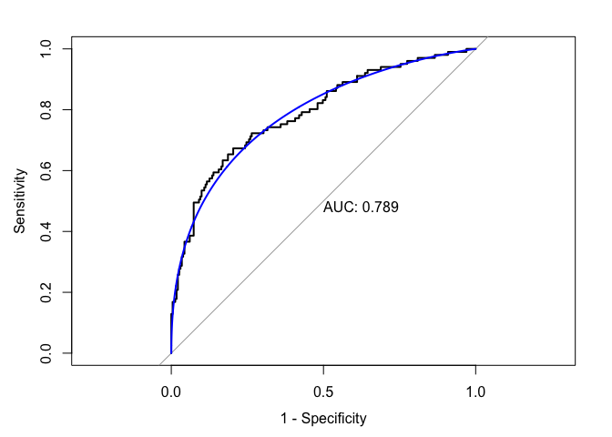
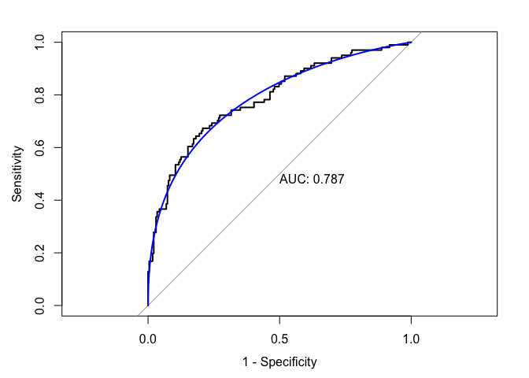
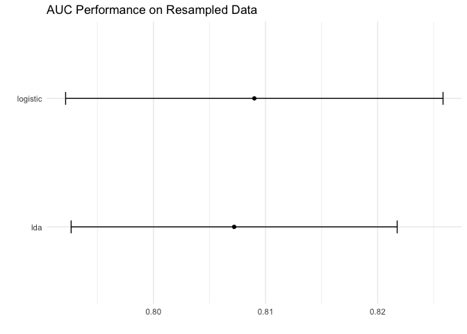

Simple Models
================
Laura Cosgrove
5/1/2019

The class of “simple”, i.e., interpretable and inflexible,
classification models can be thought to include:

  - Logistic Regression

  - Linear Discriminant Analysis

<!-- end list -->

``` r
library(tidyverse)
```

    ## Registered S3 methods overwritten by 'ggplot2':
    ##   method         from 
    ##   [.quosures     rlang
    ##   c.quosures     rlang
    ##   print.quosures rlang

    ## Registered S3 method overwritten by 'rvest':
    ##   method            from
    ##   read_xml.response xml2

    ## ── Attaching packages ───────────────────────────────────────────── tidyverse 1.2.1 ──

    ## ✔ ggplot2 3.1.1       ✔ purrr   0.3.2  
    ## ✔ tibble  2.1.1       ✔ dplyr   0.8.0.1
    ## ✔ tidyr   0.8.3       ✔ stringr 1.4.0  
    ## ✔ readr   1.3.1       ✔ forcats 0.4.0

    ## ── Conflicts ──────────────────────────────────────────────── tidyverse_conflicts() ──
    ## ✖ dplyr::filter() masks stats::filter()
    ## ✖ dplyr::lag()    masks stats::lag()

``` r
library(caret)
```

    ## Loading required package: lattice

    ## 
    ## Attaching package: 'caret'

    ## The following object is masked from 'package:purrr':
    ## 
    ##     lift

``` r
library(pROC)
```

    ## Type 'citation("pROC")' for a citation.

    ## 
    ## Attaching package: 'pROC'

    ## The following objects are masked from 'package:stats':
    ## 
    ##     cov, smooth, var

``` r
library(RANN)
```

# Variable Selection (Linear Combos, Zero Variance, Multicollinearity)

``` r
cog_data <- readRDS("./data/cog_data.RDS") %>% select(-mmse, -year_round)

##Linear Combos
findLinearCombos(cog_data[3:17] %>% drop_na())
```

    ## $linearCombos
    ## $linearCombos[[1]]
    ## [1] 9 7 8
    ## 
    ## $linearCombos[[2]]
    ## [1] 15 13 14
    ## 
    ## 
    ## $remove
    ## [1]  9 15

``` r
colnames(cog_data[3:17]) #drop 9, cortex vol, and 15, cortical_white_matter_vol
```

    ##  [1] "age"                          "protective_e2"               
    ##  [3] "risk_e4"                      "height"                      
    ##  [5] "weight"                       "intra_cranial_vol"           
    ##  [7] "lh_cortex_vol"                "rh_cortex_vol"               
    ##  [9] "cortex_vol"                   "sub_cort_gray_vol"           
    ## [11] "total_gray_vol"               "supra_tentorial_vol"         
    ## [13] "lh_cortical_white_matter_vol" "rh_cortical_white_matter_vol"
    ## [15] "cortical_white_matter_vol"

``` r
cog_data <- cog_data %>% 
  select(-cortex_vol, -cortical_white_matter_vol) 

##Near Zero Variance
nearZeroVar(cog_data[3:15], saveMetrics= TRUE) #we good
```

    ##                              freqRatio percentUnique zeroVar   nzv
    ## age                           1.000000    99.2978937   FALSE FALSE
    ## protective_e2                 5.942446     0.3009027   FALSE FALSE
    ## risk_e4                       1.677326     0.3009027   FALSE FALSE
    ## height                        1.137931     2.6078235   FALSE FALSE
    ## weight                        1.052632    17.7532598   FALSE FALSE
    ## intra_cranial_vol             1.000000   100.0000000   FALSE FALSE
    ## lh_cortex_vol                 1.000000   100.0000000   FALSE FALSE
    ## rh_cortex_vol                 1.000000   100.0000000   FALSE FALSE
    ## sub_cort_gray_vol             1.000000    97.8936810   FALSE FALSE
    ## total_gray_vol                1.000000   100.0000000   FALSE FALSE
    ## supra_tentorial_vol           1.000000   100.0000000   FALSE FALSE
    ## lh_cortical_white_matter_vol  1.000000   100.0000000   FALSE FALSE
    ## rh_cortical_white_matter_vol  1.000000   100.0000000   FALSE FALSE

``` r
## Correlation
desc_cor <- cor(cog_data[3:15] %>% drop_na())
summary(desc_cor[upper.tri(desc_cor)])
```

    ##    Min. 1st Qu.  Median    Mean 3rd Qu.    Max. 
    ## -0.3459 -0.0308  0.2525  0.2841  0.6403  0.9852

``` r
highlyCorDescr <- findCorrelation(desc_cor, cutoff = .80) 
# Drops: total_gray_vol, supra_tentorial_vol, lh_cortical_white_matter_vol, rh_cortex_vol: makes sense.
# Retains intra_cranial_vol, lh_cortex_vol, sub_cort_gray_vol, and rh_cortical_white_matter_vol

cog_data <- cog_data %>% 
  select(-total_gray_vol, -supra_tentorial_vol, -lh_cortical_white_matter_vol, -rh_cortex_vol) #from documentation: TotalGray - total gray matter volume. This is simply the sum of lhCortex + rhCortex + SubCortGray + CerebellumGM

desc_cor2 <- cor(cog_data[3:11] %>% drop_na())
highlyCorDescr <- findCorrelation(desc_cor2, cutoff = .80)  #none over .8
summary(desc_cor2[upper.tri(desc_cor2)]) #still some high correlation
```

    ##     Min.  1st Qu.   Median     Mean  3rd Qu.     Max. 
    ## -0.32858 -0.05715  0.02414  0.12040  0.29972  0.72831

``` r
write_rds(cog_data, "./data/cog_data_preproc.RDS")
```

# Preprocessing

First, divide into training and test:

``` r
cog_data <- readRDS("./data/cog_data_preproc.RDS")

set.seed(1)
train_index <- createDataPartition(cog_data$cdr, p = 2/3, list = FALSE, times = 1)

cog_train <- cog_data[train_index,] 
cog_test  <- cog_data[-train_index,]
```

## Imputation and Centering/scaling

``` r
skimr::skim(cog_train[3:11])
```

    ## Registered S3 method overwritten by 'skimr':
    ##   method      from  
    ##   print.spark pillar

    ## Skim summary statistics
    ##  n obs: 665 
    ##  n variables: 9 
    ## 
    ## ── Variable type:numeric ─────────────────────────────────────────────────────────────
    ##                      variable missing complete   n       mean        sd
    ##                           age       0      665 665      72.67      9.36
    ##                        height      34      631 665      65.93      3.87
    ##             intra_cranial_vol       0      665 665 1507868.21 190577.8 
    ##                 lh_cortex_vol       0      665 665   2e+05     23185.66
    ##                 protective_e2      15      650 665       0.16      0.4 
    ##  rh_cortical_white_matter_vol       0      665 665  211772.87  29794.59
    ##                       risk_e4      15      650 665       0.46      0.6 
    ##             sub_cort_gray_vol       0      665 665   56996.57  26982.41
    ##                        weight      18      647 665     168.6      36.86
    ##         p0        p25        p50        p75       p100     hist
    ##      42.47      67.25      72.99      79         95.57 ▁▁▂▆▇▇▃▁
    ##      52         63         66         69         79    ▁▁▅▇▇▆▁▁
    ##  865980.06 1371360.9  1491510.38 1636947.85 2224499.83 ▁▁▅▇▆▃▁▁
    ##  128725.48  183599.7    2e+05     216088.41  274818.87 ▁▁▅▇▆▃▁▁
    ##       0          0          0          0          2    ▇▁▁▁▁▁▁▁
    ##  134226.69  190651.65  211041.38  230374.62  315864.78 ▁▃▆▇▅▂▁▁
    ##       0          0          0          1          2    ▇▁▁▅▁▁▁▁
    ##   34898      47025      50989      54902     208749.17 ▇▁▁▁▁▁▁▁
    ##      81        142.5      165        191        317    ▁▅▇▇▃▂▁▁

``` r
#note: all vars positive,
#note: <10% missing: perfect to impute
set.seed(12)
preProc_fn <- preProcess(cog_train[3:11], 
           method = c("center", "scale", "knnImpute"),
          k = 5,
          knnSummary = mean,
          verbose = TRUE)
```

    ## Calculating 9 means for centering
    ## Calculating 9 standard deviations for scaling

``` r
cog_train[3:11] <- predict(preProc_fn, cog_train[3:11]) 
cog_test[3:11] <- predict(preProc_fn, cog_test[3:11]) 

#Write RDS
write_rds(cog_train, "./data/cog_train_preproc.RDS")
write_rds(cog_test, "./data/cog_test_preproc.RDS")
```

More `caret` data preparation:

``` r
# Using caret
ctrl1 <- trainControl(method = "repeatedcv",
                     repeats = 5,
                     summaryFunction = twoClassSummary, #because we're in the two-class setting
                     classProbs = TRUE) #because need predicted class probabilities to get ROC curve

#Read RDS 
cog_train <- readRDS("./data/cog_train_preproc.RDS")
cog_test <- readRDS("./data/cog_test_preproc.RDS")
```

# Logistic Regression

``` r
set.seed(12)
logit_fit <- train(x = cog_train[3:11],
                   y = cog_train$cdr,
                   method = "glm",
                   metric = "ROC",
                   trControl = ctrl1)


logit_fit #Resampled AUC: 0.8089988 
```

    ## Generalized Linear Model 
    ## 
    ## 665 samples
    ##   9 predictor
    ##   2 classes: 'NonDementia', 'Dementia' 
    ## 
    ## No pre-processing
    ## Resampling: Cross-Validated (10 fold, repeated 5 times) 
    ## Summary of sample sizes: 599, 599, 599, 598, 599, 599, ... 
    ## Resampling results:
    ## 
    ##   ROC        Sens       Spec     
    ##   0.8089988  0.9071508  0.5057143

``` r
summary(logit_fit$finalModel) 
```

    ## 
    ## Call:
    ## NULL
    ## 
    ## Deviance Residuals: 
    ##     Min       1Q   Median       3Q      Max  
    ## -2.1547  -0.7194  -0.4399   0.7488   2.8118  
    ## 
    ## Coefficients:
    ##                              Estimate Std. Error z value Pr(>|z|)    
    ## (Intercept)                  -1.12883    0.10831 -10.423  < 2e-16 ***
    ## age                          -0.17117    0.13605  -1.258 0.208351    
    ## protective_e2                -0.02251    0.10970  -0.205 0.837448    
    ## risk_e4                       0.48102    0.10149   4.740 2.14e-06 ***
    ## height                        0.05020    0.14052   0.357 0.720911    
    ## weight                        0.13087    0.12431   1.053 0.292431    
    ## intra_cranial_vol             1.78732    0.22326   8.006 1.19e-15 ***
    ## lh_cortex_vol                -1.49366    0.18363  -8.134 4.15e-16 ***
    ## sub_cort_gray_vol             0.30240    0.10053   3.008 0.002630 ** 
    ## rh_cortical_white_matter_vol -0.68430    0.19421  -3.523 0.000426 ***
    ## ---
    ## Signif. codes:  0 '***' 0.001 '**' 0.01 '*' 0.05 '.' 0.1 ' ' 1
    ## 
    ## (Dispersion parameter for binomial family taken to be 1)
    ## 
    ##     Null deviance: 816.64  on 664  degrees of freedom
    ## Residual deviance: 623.37  on 655  degrees of freedom
    ## AIC: 643.37
    ## 
    ## Number of Fisher Scoring iterations: 5

``` r
train_pred_prob  <- predict(logit_fit, type = "prob")
```

``` r
##Model Fit (for my practice)
broom::glance(logit_fit$finalModel)
```

    ## # A tibble: 1 x 7
    ##   null.deviance df.null logLik   AIC   BIC deviance df.residual
    ##           <dbl>   <int>  <dbl> <dbl> <dbl>    <dbl>       <int>
    ## 1          817.     664  -312.  643.  688.     623.         655

``` r
dev <- broom::glance(logit_fit$finalModel) %>% 
  pull(deviance)

pval = 1 - pchisq(dev, 655) #DOF = 665 (49 rows with NA) - 9 predictors - 1
pval #FTR, model is acceptable.
```

    ## [1] 0.8077907

``` r
#Against Null
null_dev <- broom::glance(logit_fit$finalModel) %>% 
  pull(null.deviance)

test_stat = null_dev - dev
pval = 1 - pchisq(test_stat, df = 9) #DOF = 664 - 655 
pval #Reject, go with the larger model
```

    ## [1] 0

## Performance on test data

``` r
test_pred  <- predict(logit_fit, newdata = cog_test, type = "raw")

confusionMatrix(data = test_pred, 
                reference = cog_test$cdr,
                positive = "Dementia")
```

    ## Confusion Matrix and Statistics
    ## 
    ##              Reference
    ## Prediction    NonDementia Dementia
    ##   NonDementia         209       49
    ##   Dementia             22       52
    ##                                          
    ##                Accuracy : 0.7861         
    ##                  95% CI : (0.7381, 0.829)
    ##     No Information Rate : 0.6958         
    ##     P-Value [Acc > NIR] : 0.0001433      
    ##                                          
    ##                   Kappa : 0.4537         
    ##                                          
    ##  Mcnemar's Test P-Value : 0.0020312      
    ##                                          
    ##             Sensitivity : 0.5149         
    ##             Specificity : 0.9048         
    ##          Pos Pred Value : 0.7027         
    ##          Neg Pred Value : 0.8101         
    ##              Prevalence : 0.3042         
    ##          Detection Rate : 0.1566         
    ##    Detection Prevalence : 0.2229         
    ##       Balanced Accuracy : 0.7098         
    ##                                          
    ##        'Positive' Class : Dementia       
    ## 

``` r
test_pred_prob  <- predict(logit_fit, newdata = cog_test, type = "prob")

roc_logit_test <- roc(cog_test$cdr, test_pred_prob$Dementia)

plot(roc_logit_test, legacy.axes = TRUE, print.auc = TRUE) 
plot(smooth(roc_logit_test), col = 4, add = TRUE) 
```

<!-- -->

Risk allele e4, intra\_cranial\_vol, lh\_cortex\_vol,
rh\_cortical\_white\_matter\_vol, and sub\_cort\_gray\_vol are all
significant. Unfortunately, sub\_cort\_gray\_vol is not in the expected
direction, and intracranial volume really shouldn’t carry any
information. We saw some funny results with sub\_cort\_gray\_vol in EDA;
perhaps we should go with total gray volume as a coefficient instead.

# Linear Discriminant Analysis

``` r
set.seed(13)
lda_fit <- train(x = cog_train[3:11],
                   y = cog_train$cdr,
                   method = "lda", #no tuning parameter
                   metric = "ROC",
                   trControl = ctrl1)

lda_fit #Resampled AUC: 0.8071995
```

    ## Linear Discriminant Analysis 
    ## 
    ## 665 samples
    ##   9 predictor
    ##   2 classes: 'NonDementia', 'Dementia' 
    ## 
    ## No pre-processing
    ## Resampling: Cross-Validated (10 fold, repeated 5 times) 
    ## Summary of sample sizes: 599, 599, 599, 599, 598, 598, ... 
    ## Resampling results:
    ## 
    ##   ROC        Sens       Spec     
    ##   0.8071995  0.9140056  0.4804286

``` r
lda_fit$finalModel
```

    ## Call:
    ## lda(x, y)
    ## 
    ## Prior probabilities of groups:
    ## NonDementia    Dementia 
    ##   0.6962406   0.3037594 
    ## 
    ## Group means:
    ##                    age protective_e2    risk_e4      height       weight
    ## NonDementia -0.1457522    0.03272405 -0.1231886 -0.03302235  0.003023402
    ## Dementia     0.3340756   -0.08028824  0.2887381  0.05559531 -0.021338326
    ##             intra_cranial_vol lh_cortex_vol sub_cort_gray_vol
    ## NonDementia        -0.0923435     0.1639895       -0.01337828
    ## Dementia            0.2116586    -0.3758769        0.03066408
    ##             rh_cortical_white_matter_vol
    ## NonDementia                   0.06411319
    ## Dementia                     -0.14695252
    ## 
    ## Coefficients of linear discriminants:
    ##                                       LD1
    ## age                          -0.122996943
    ## protective_e2                -0.009202885
    ## risk_e4                       0.392933668
    ## height                        0.055813272
    ## weight                        0.103698414
    ## intra_cranial_vol             1.335205675
    ## lh_cortex_vol                -1.197750114
    ## sub_cort_gray_vol             0.237329553
    ## rh_cortical_white_matter_vol -0.454222612

``` r
train_pred_prob_lda  <- predict(lda_fit, type = "prob")
```

Here, we see that intracranial volume and lh\_cortex\_vol have the
largest discriminating values on the data;
rh\_cortical\_white\_matter\_vol and risk\_e4 are in the second tier of
importance. This dovetails nicely with our logistic regression results.

## Performance on test data

``` r
test_pred_lda  <- predict(lda_fit, newdata = cog_test, type = "raw")

confusionMatrix(data = test_pred_lda, 
                reference = cog_test$cdr,
                positive = "Dementia")
```

    ## Confusion Matrix and Statistics
    ## 
    ##              Reference
    ## Prediction    NonDementia Dementia
    ##   NonDementia         209       51
    ##   Dementia             22       50
    ##                                           
    ##                Accuracy : 0.7801          
    ##                  95% CI : (0.7317, 0.8235)
    ##     No Information Rate : 0.6958          
    ##     P-Value [Acc > NIR] : 0.0003734       
    ##                                           
    ##                   Kappa : 0.435           
    ##                                           
    ##  Mcnemar's Test P-Value : 0.0010486       
    ##                                           
    ##             Sensitivity : 0.4950          
    ##             Specificity : 0.9048          
    ##          Pos Pred Value : 0.6944          
    ##          Neg Pred Value : 0.8038          
    ##              Prevalence : 0.3042          
    ##          Detection Rate : 0.1506          
    ##    Detection Prevalence : 0.2169          
    ##       Balanced Accuracy : 0.6999          
    ##                                           
    ##        'Positive' Class : Dementia        
    ## 

``` r
test_pred_prob_lda  <- predict(lda_fit, newdata = cog_test, type = "prob")

roc_lda_test <- roc(cog_test$cdr, test_pred_prob_lda$Dementia)

plot(roc_lda_test, legacy.axes = TRUE, print.auc = TRUE) 
plot(smooth(roc_lda_test), col = 4, add = TRUE) 
```

<!-- -->

# Logistic vs. LDA:

``` r
res <- resamples(list(logistic = logit_fit,
                 lda = lda_fit)
                 )
ggplot(res) + labs(title = "AUC Performance on Resampled Data") + theme_minimal()
```

<!-- -->
