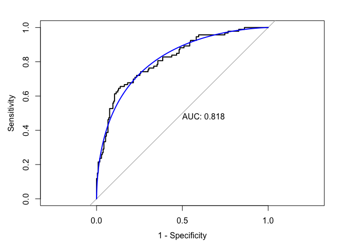

Simple Models
================
Laura Cosgrove
5/1/2019

The class of “simple”, i.e., interpretable and inflexible,
classification models can be thought to include:

  - Logistic Regression

  - Linear Discriminant Analysis

<!-- end list -->

``` r
library(tidyverse)
```

    ## Registered S3 methods overwritten by 'ggplot2':
    ##   method         from 
    ##   [.quosures     rlang
    ##   c.quosures     rlang
    ##   print.quosures rlang

    ## Registered S3 method overwritten by 'rvest':
    ##   method            from
    ##   read_xml.response xml2

    ## ── Attaching packages ──────────────────────────────────────────────────────────── tidyverse 1.2.1 ──

    ## ✔ ggplot2 3.1.1       ✔ purrr   0.3.2  
    ## ✔ tibble  2.1.1       ✔ dplyr   0.8.0.1
    ## ✔ tidyr   0.8.3       ✔ stringr 1.4.0  
    ## ✔ readr   1.3.1       ✔ forcats 0.4.0

    ## ── Conflicts ─────────────────────────────────────────────────────────────── tidyverse_conflicts() ──
    ## ✖ dplyr::filter() masks stats::filter()
    ## ✖ dplyr::lag()    masks stats::lag()

``` r
library(caret)
```

    ## Loading required package: lattice

    ## 
    ## Attaching package: 'caret'

    ## The following object is masked from 'package:purrr':
    ## 
    ##     lift

``` r
library(pROC)
```

    ## Type 'citation("pROC")' for a citation.

    ## 
    ## Attaching package: 'pROC'

    ## The following objects are masked from 'package:stats':
    ## 
    ##     cov, smooth, var

``` r
cog_data <- readRDS("./data/cog_data.RDS")
```

``` r
set.seed(1)
train_index <- createDataPartition(cog_data$cdr, p = 0.66, list = FALSE, times = 1)

cog_train <- cog_data[train_index,] %>% select(-mmse)
cog_test  <- cog_data[-train_index,]

levels(cog_train$cdr)
```

    ## [1] "NonDementia" "Dementia"

More `caret` data preparation:

``` r
# Using caret
ctrl1 <- trainControl(method = "repeatedcv",
                     repeats = 5,
                     summaryFunction = twoClassSummary, #because we're in the two-class setting
                     classProbs = TRUE) #because need predicted class probabilities to get ROC curve
```

# Logistic Regression

``` r
set.seed(12)
logit_fit <- train(x = cog_train[4:18],
                   y = cog_train$cdr,
                   method = "glm",
                   metric = "ROC",
                   trControl = ctrl1)
```

    ## Warning: Setting row names on a tibble is deprecated.

    ## Warning in predict.lm(object, newdata, se.fit, scale = 1, type = if (type
    ## == : prediction from a rank-deficient fit may be misleading
    
    ## Warning in predict.lm(object, newdata, se.fit, scale = 1, type = if (type
    ## == : prediction from a rank-deficient fit may be misleading

    ## Warning: Setting row names on a tibble is deprecated.

    ## Warning in predict.lm(object, newdata, se.fit, scale = 1, type = if (type
    ## == : prediction from a rank-deficient fit may be misleading
    
    ## Warning in predict.lm(object, newdata, se.fit, scale = 1, type = if (type
    ## == : prediction from a rank-deficient fit may be misleading

    ## Warning: Setting row names on a tibble is deprecated.

    ## Warning in predict.lm(object, newdata, se.fit, scale = 1, type = if (type
    ## == : prediction from a rank-deficient fit may be misleading
    
    ## Warning in predict.lm(object, newdata, se.fit, scale = 1, type = if (type
    ## == : prediction from a rank-deficient fit may be misleading

    ## Warning: Setting row names on a tibble is deprecated.

    ## Warning in predict.lm(object, newdata, se.fit, scale = 1, type = if (type
    ## == : prediction from a rank-deficient fit may be misleading
    
    ## Warning in predict.lm(object, newdata, se.fit, scale = 1, type = if (type
    ## == : prediction from a rank-deficient fit may be misleading

    ## Warning: Setting row names on a tibble is deprecated.

    ## Warning in predict.lm(object, newdata, se.fit, scale = 1, type = if (type
    ## == : prediction from a rank-deficient fit may be misleading
    
    ## Warning in predict.lm(object, newdata, se.fit, scale = 1, type = if (type
    ## == : prediction from a rank-deficient fit may be misleading

    ## Warning: Setting row names on a tibble is deprecated.

    ## Warning in predict.lm(object, newdata, se.fit, scale = 1, type = if (type
    ## == : prediction from a rank-deficient fit may be misleading
    
    ## Warning in predict.lm(object, newdata, se.fit, scale = 1, type = if (type
    ## == : prediction from a rank-deficient fit may be misleading

    ## Warning: Setting row names on a tibble is deprecated.

    ## Warning in predict.lm(object, newdata, se.fit, scale = 1, type = if (type
    ## == : prediction from a rank-deficient fit may be misleading
    
    ## Warning in predict.lm(object, newdata, se.fit, scale = 1, type = if (type
    ## == : prediction from a rank-deficient fit may be misleading

    ## Warning: Setting row names on a tibble is deprecated.

    ## Warning in predict.lm(object, newdata, se.fit, scale = 1, type = if (type
    ## == : prediction from a rank-deficient fit may be misleading
    
    ## Warning in predict.lm(object, newdata, se.fit, scale = 1, type = if (type
    ## == : prediction from a rank-deficient fit may be misleading

    ## Warning: Setting row names on a tibble is deprecated.

    ## Warning in predict.lm(object, newdata, se.fit, scale = 1, type = if (type
    ## == : prediction from a rank-deficient fit may be misleading
    
    ## Warning in predict.lm(object, newdata, se.fit, scale = 1, type = if (type
    ## == : prediction from a rank-deficient fit may be misleading

    ## Warning: Setting row names on a tibble is deprecated.

    ## Warning in predict.lm(object, newdata, se.fit, scale = 1, type = if (type
    ## == : prediction from a rank-deficient fit may be misleading
    
    ## Warning in predict.lm(object, newdata, se.fit, scale = 1, type = if (type
    ## == : prediction from a rank-deficient fit may be misleading

    ## Warning: Setting row names on a tibble is deprecated.

    ## Warning in predict.lm(object, newdata, se.fit, scale = 1, type = if (type
    ## == : prediction from a rank-deficient fit may be misleading
    
    ## Warning in predict.lm(object, newdata, se.fit, scale = 1, type = if (type
    ## == : prediction from a rank-deficient fit may be misleading

    ## Warning: Setting row names on a tibble is deprecated.

    ## Warning in predict.lm(object, newdata, se.fit, scale = 1, type = if (type
    ## == : prediction from a rank-deficient fit may be misleading
    
    ## Warning in predict.lm(object, newdata, se.fit, scale = 1, type = if (type
    ## == : prediction from a rank-deficient fit may be misleading

    ## Warning: Setting row names on a tibble is deprecated.

    ## Warning in predict.lm(object, newdata, se.fit, scale = 1, type = if (type
    ## == : prediction from a rank-deficient fit may be misleading
    
    ## Warning in predict.lm(object, newdata, se.fit, scale = 1, type = if (type
    ## == : prediction from a rank-deficient fit may be misleading

    ## Warning: Setting row names on a tibble is deprecated.

    ## Warning in predict.lm(object, newdata, se.fit, scale = 1, type = if (type
    ## == : prediction from a rank-deficient fit may be misleading
    
    ## Warning in predict.lm(object, newdata, se.fit, scale = 1, type = if (type
    ## == : prediction from a rank-deficient fit may be misleading

    ## Warning: Setting row names on a tibble is deprecated.

    ## Warning in predict.lm(object, newdata, se.fit, scale = 1, type = if (type
    ## == : prediction from a rank-deficient fit may be misleading
    
    ## Warning in predict.lm(object, newdata, se.fit, scale = 1, type = if (type
    ## == : prediction from a rank-deficient fit may be misleading

    ## Warning: Setting row names on a tibble is deprecated.

    ## Warning in predict.lm(object, newdata, se.fit, scale = 1, type = if (type
    ## == : prediction from a rank-deficient fit may be misleading
    
    ## Warning in predict.lm(object, newdata, se.fit, scale = 1, type = if (type
    ## == : prediction from a rank-deficient fit may be misleading

    ## Warning: Setting row names on a tibble is deprecated.

    ## Warning in predict.lm(object, newdata, se.fit, scale = 1, type = if (type
    ## == : prediction from a rank-deficient fit may be misleading
    
    ## Warning in predict.lm(object, newdata, se.fit, scale = 1, type = if (type
    ## == : prediction from a rank-deficient fit may be misleading

    ## Warning: Setting row names on a tibble is deprecated.

    ## Warning in predict.lm(object, newdata, se.fit, scale = 1, type = if (type
    ## == : prediction from a rank-deficient fit may be misleading
    
    ## Warning in predict.lm(object, newdata, se.fit, scale = 1, type = if (type
    ## == : prediction from a rank-deficient fit may be misleading

    ## Warning: Setting row names on a tibble is deprecated.

    ## Warning in predict.lm(object, newdata, se.fit, scale = 1, type = if (type
    ## == : prediction from a rank-deficient fit may be misleading
    
    ## Warning in predict.lm(object, newdata, se.fit, scale = 1, type = if (type
    ## == : prediction from a rank-deficient fit may be misleading

    ## Warning: Setting row names on a tibble is deprecated.

    ## Warning in predict.lm(object, newdata, se.fit, scale = 1, type = if (type
    ## == : prediction from a rank-deficient fit may be misleading
    
    ## Warning in predict.lm(object, newdata, se.fit, scale = 1, type = if (type
    ## == : prediction from a rank-deficient fit may be misleading

    ## Warning: Setting row names on a tibble is deprecated.

    ## Warning in predict.lm(object, newdata, se.fit, scale = 1, type = if (type
    ## == : prediction from a rank-deficient fit may be misleading
    
    ## Warning in predict.lm(object, newdata, se.fit, scale = 1, type = if (type
    ## == : prediction from a rank-deficient fit may be misleading

    ## Warning: Setting row names on a tibble is deprecated.

    ## Warning in predict.lm(object, newdata, se.fit, scale = 1, type = if (type
    ## == : prediction from a rank-deficient fit may be misleading
    
    ## Warning in predict.lm(object, newdata, se.fit, scale = 1, type = if (type
    ## == : prediction from a rank-deficient fit may be misleading

    ## Warning: Setting row names on a tibble is deprecated.

    ## Warning in predict.lm(object, newdata, se.fit, scale = 1, type = if (type
    ## == : prediction from a rank-deficient fit may be misleading
    
    ## Warning in predict.lm(object, newdata, se.fit, scale = 1, type = if (type
    ## == : prediction from a rank-deficient fit may be misleading

    ## Warning: Setting row names on a tibble is deprecated.

    ## Warning in predict.lm(object, newdata, se.fit, scale = 1, type = if (type
    ## == : prediction from a rank-deficient fit may be misleading
    
    ## Warning in predict.lm(object, newdata, se.fit, scale = 1, type = if (type
    ## == : prediction from a rank-deficient fit may be misleading

    ## Warning: Setting row names on a tibble is deprecated.

    ## Warning in predict.lm(object, newdata, se.fit, scale = 1, type = if (type
    ## == : prediction from a rank-deficient fit may be misleading
    
    ## Warning in predict.lm(object, newdata, se.fit, scale = 1, type = if (type
    ## == : prediction from a rank-deficient fit may be misleading

    ## Warning: Setting row names on a tibble is deprecated.

    ## Warning in predict.lm(object, newdata, se.fit, scale = 1, type = if (type
    ## == : prediction from a rank-deficient fit may be misleading
    
    ## Warning in predict.lm(object, newdata, se.fit, scale = 1, type = if (type
    ## == : prediction from a rank-deficient fit may be misleading

    ## Warning: Setting row names on a tibble is deprecated.

    ## Warning in predict.lm(object, newdata, se.fit, scale = 1, type = if (type
    ## == : prediction from a rank-deficient fit may be misleading
    
    ## Warning in predict.lm(object, newdata, se.fit, scale = 1, type = if (type
    ## == : prediction from a rank-deficient fit may be misleading

    ## Warning: Setting row names on a tibble is deprecated.

    ## Warning in predict.lm(object, newdata, se.fit, scale = 1, type = if (type
    ## == : prediction from a rank-deficient fit may be misleading
    
    ## Warning in predict.lm(object, newdata, se.fit, scale = 1, type = if (type
    ## == : prediction from a rank-deficient fit may be misleading

    ## Warning: Setting row names on a tibble is deprecated.

    ## Warning in predict.lm(object, newdata, se.fit, scale = 1, type = if (type
    ## == : prediction from a rank-deficient fit may be misleading
    
    ## Warning in predict.lm(object, newdata, se.fit, scale = 1, type = if (type
    ## == : prediction from a rank-deficient fit may be misleading

    ## Warning: Setting row names on a tibble is deprecated.

    ## Warning in predict.lm(object, newdata, se.fit, scale = 1, type = if (type
    ## == : prediction from a rank-deficient fit may be misleading
    
    ## Warning in predict.lm(object, newdata, se.fit, scale = 1, type = if (type
    ## == : prediction from a rank-deficient fit may be misleading

    ## Warning: Setting row names on a tibble is deprecated.

    ## Warning in predict.lm(object, newdata, se.fit, scale = 1, type = if (type
    ## == : prediction from a rank-deficient fit may be misleading
    
    ## Warning in predict.lm(object, newdata, se.fit, scale = 1, type = if (type
    ## == : prediction from a rank-deficient fit may be misleading

    ## Warning: Setting row names on a tibble is deprecated.

    ## Warning in predict.lm(object, newdata, se.fit, scale = 1, type = if (type
    ## == : prediction from a rank-deficient fit may be misleading
    
    ## Warning in predict.lm(object, newdata, se.fit, scale = 1, type = if (type
    ## == : prediction from a rank-deficient fit may be misleading

    ## Warning: Setting row names on a tibble is deprecated.

    ## Warning in predict.lm(object, newdata, se.fit, scale = 1, type = if (type
    ## == : prediction from a rank-deficient fit may be misleading
    
    ## Warning in predict.lm(object, newdata, se.fit, scale = 1, type = if (type
    ## == : prediction from a rank-deficient fit may be misleading

    ## Warning: Setting row names on a tibble is deprecated.

    ## Warning in predict.lm(object, newdata, se.fit, scale = 1, type = if (type
    ## == : prediction from a rank-deficient fit may be misleading
    
    ## Warning in predict.lm(object, newdata, se.fit, scale = 1, type = if (type
    ## == : prediction from a rank-deficient fit may be misleading

    ## Warning: Setting row names on a tibble is deprecated.

    ## Warning in predict.lm(object, newdata, se.fit, scale = 1, type = if (type
    ## == : prediction from a rank-deficient fit may be misleading
    
    ## Warning in predict.lm(object, newdata, se.fit, scale = 1, type = if (type
    ## == : prediction from a rank-deficient fit may be misleading

    ## Warning: Setting row names on a tibble is deprecated.

    ## Warning in predict.lm(object, newdata, se.fit, scale = 1, type = if (type
    ## == : prediction from a rank-deficient fit may be misleading
    
    ## Warning in predict.lm(object, newdata, se.fit, scale = 1, type = if (type
    ## == : prediction from a rank-deficient fit may be misleading

    ## Warning: Setting row names on a tibble is deprecated.

    ## Warning in predict.lm(object, newdata, se.fit, scale = 1, type = if (type
    ## == : prediction from a rank-deficient fit may be misleading
    
    ## Warning in predict.lm(object, newdata, se.fit, scale = 1, type = if (type
    ## == : prediction from a rank-deficient fit may be misleading

    ## Warning: Setting row names on a tibble is deprecated.

    ## Warning in predict.lm(object, newdata, se.fit, scale = 1, type = if (type
    ## == : prediction from a rank-deficient fit may be misleading
    
    ## Warning in predict.lm(object, newdata, se.fit, scale = 1, type = if (type
    ## == : prediction from a rank-deficient fit may be misleading

    ## Warning: Setting row names on a tibble is deprecated.

    ## Warning in predict.lm(object, newdata, se.fit, scale = 1, type = if (type
    ## == : prediction from a rank-deficient fit may be misleading
    
    ## Warning in predict.lm(object, newdata, se.fit, scale = 1, type = if (type
    ## == : prediction from a rank-deficient fit may be misleading

    ## Warning: Setting row names on a tibble is deprecated.

    ## Warning in predict.lm(object, newdata, se.fit, scale = 1, type = if (type
    ## == : prediction from a rank-deficient fit may be misleading
    
    ## Warning in predict.lm(object, newdata, se.fit, scale = 1, type = if (type
    ## == : prediction from a rank-deficient fit may be misleading

    ## Warning: Setting row names on a tibble is deprecated.

    ## Warning in predict.lm(object, newdata, se.fit, scale = 1, type = if (type
    ## == : prediction from a rank-deficient fit may be misleading
    
    ## Warning in predict.lm(object, newdata, se.fit, scale = 1, type = if (type
    ## == : prediction from a rank-deficient fit may be misleading

    ## Warning: Setting row names on a tibble is deprecated.

    ## Warning in predict.lm(object, newdata, se.fit, scale = 1, type = if (type
    ## == : prediction from a rank-deficient fit may be misleading
    
    ## Warning in predict.lm(object, newdata, se.fit, scale = 1, type = if (type
    ## == : prediction from a rank-deficient fit may be misleading

    ## Warning: Setting row names on a tibble is deprecated.

    ## Warning in predict.lm(object, newdata, se.fit, scale = 1, type = if (type
    ## == : prediction from a rank-deficient fit may be misleading
    
    ## Warning in predict.lm(object, newdata, se.fit, scale = 1, type = if (type
    ## == : prediction from a rank-deficient fit may be misleading

    ## Warning: Setting row names on a tibble is deprecated.

    ## Warning in predict.lm(object, newdata, se.fit, scale = 1, type = if (type
    ## == : prediction from a rank-deficient fit may be misleading
    
    ## Warning in predict.lm(object, newdata, se.fit, scale = 1, type = if (type
    ## == : prediction from a rank-deficient fit may be misleading

    ## Warning: Setting row names on a tibble is deprecated.

    ## Warning in predict.lm(object, newdata, se.fit, scale = 1, type = if (type
    ## == : prediction from a rank-deficient fit may be misleading
    
    ## Warning in predict.lm(object, newdata, se.fit, scale = 1, type = if (type
    ## == : prediction from a rank-deficient fit may be misleading

    ## Warning: Setting row names on a tibble is deprecated.

    ## Warning in predict.lm(object, newdata, se.fit, scale = 1, type = if (type
    ## == : prediction from a rank-deficient fit may be misleading
    
    ## Warning in predict.lm(object, newdata, se.fit, scale = 1, type = if (type
    ## == : prediction from a rank-deficient fit may be misleading

    ## Warning: Setting row names on a tibble is deprecated.

    ## Warning in predict.lm(object, newdata, se.fit, scale = 1, type = if (type
    ## == : prediction from a rank-deficient fit may be misleading
    
    ## Warning in predict.lm(object, newdata, se.fit, scale = 1, type = if (type
    ## == : prediction from a rank-deficient fit may be misleading

    ## Warning: Setting row names on a tibble is deprecated.

    ## Warning in predict.lm(object, newdata, se.fit, scale = 1, type = if (type
    ## == : prediction from a rank-deficient fit may be misleading
    
    ## Warning in predict.lm(object, newdata, se.fit, scale = 1, type = if (type
    ## == : prediction from a rank-deficient fit may be misleading

    ## Warning: Setting row names on a tibble is deprecated.

    ## Warning in predict.lm(object, newdata, se.fit, scale = 1, type = if (type
    ## == : prediction from a rank-deficient fit may be misleading
    
    ## Warning in predict.lm(object, newdata, se.fit, scale = 1, type = if (type
    ## == : prediction from a rank-deficient fit may be misleading

    ## Warning: Setting row names on a tibble is deprecated.

    ## Warning in predict.lm(object, newdata, se.fit, scale = 1, type = if (type
    ## == : prediction from a rank-deficient fit may be misleading
    
    ## Warning in predict.lm(object, newdata, se.fit, scale = 1, type = if (type
    ## == : prediction from a rank-deficient fit may be misleading

    ## Warning: Setting row names on a tibble is deprecated.

``` r
summary(logit_fit$finalModel) 
```

    ## 
    ## Call:
    ## NULL
    ## 
    ## Deviance Residuals: 
    ##     Min       1Q   Median       3Q      Max  
    ## -2.0727  -0.7537  -0.4917   0.8260   2.7048  
    ## 
    ## Coefficients: (2 not defined because of singularities)
    ##                                Estimate Std. Error z value Pr(>|z|)    
    ## (Intercept)                   1.134e+00  2.480e+00   0.457   0.6476    
    ## age                          -1.897e-02  1.598e-02  -1.187   0.2353    
    ## protective_e2                -1.292e-02  2.694e-01  -0.048   0.9617    
    ## risk_e4                       7.329e-01  1.679e-01   4.364 1.27e-05 ***
    ## height                        1.409e-02  3.667e-02   0.384   0.7008    
    ## weight                        1.643e-03  3.460e-03   0.475   0.6349    
    ## intra_cranial_vol             8.123e-06  1.706e-06   4.762 1.92e-06 ***
    ## lh_cortex_vol                -4.932e-05  2.650e-05  -1.861   0.0628 .  
    ## rh_cortex_vol                -1.117e-05  2.507e-05  -0.445   0.6560    
    ## cortex_vol                           NA         NA      NA       NA    
    ## sub_cort_gray_vol             6.078e-06  6.418e-06   0.947   0.3437    
    ## total_gray_vol                4.705e-07  1.226e-05   0.038   0.9694    
    ## supra_tentorial_vol           3.126e-06  6.788e-06   0.461   0.6451    
    ## lh_cortical_white_matter_vol  1.119e-05  2.071e-05   0.540   0.5889    
    ## rh_cortical_white_matter_vol -3.912e-05  2.203e-05  -1.775   0.0758 .  
    ## cortical_white_matter_vol            NA         NA      NA       NA    
    ## ---
    ## Signif. codes:  0 '***' 0.001 '**' 0.01 '*' 0.05 '.' 0.1 ' ' 1
    ## 
    ## (Dispersion parameter for binomial family taken to be 1)
    ## 
    ##     Null deviance: 753.53  on 609  degrees of freedom
    ## Residual deviance: 604.70  on 596  degrees of freedom
    ##   (49 observations deleted due to missingness)
    ## AIC: 632.7
    ## 
    ## Number of Fisher Scoring iterations: 5

``` r
test_pred_prob  <- predict(logit_fit$finalModel, newdata = cog_test,
                      type = "response")
```

    ## Warning in predict.lm(object, newdata, se.fit, scale = 1, type = if (type
    ## == : prediction from a rank-deficient fit may be misleading

``` r
test_pred <- rep("NonDementia", length(test_pred_prob))

test_pred[test_pred_prob > 0.5] <- "Dementia" 

confusionMatrix(data = as.factor(test_pred), 
                reference = cog_test$cdr,
                positive = "Dementia")
```

    ## Warning in confusionMatrix.default(data = as.factor(test_pred), reference
    ## = cog_test$cdr, : Levels are not in the same order for reference and data.
    ## Refactoring data to match.

    ## Confusion Matrix and Statistics
    ## 
    ##              Reference
    ## Prediction    NonDementia Dementia
    ##   NonDementia         216       54
    ##   Dementia             19       49
    ##                                           
    ##                Accuracy : 0.784           
    ##                  95% CI : (0.7363, 0.8267)
    ##     No Information Rate : 0.6953          
    ##     P-Value [Acc > NIR] : 0.0001652       
    ##                                           
    ##                   Kappa : 0.4365          
    ##                                           
    ##  Mcnemar's Test P-Value : 6.909e-05       
    ##                                           
    ##             Sensitivity : 0.4757          
    ##             Specificity : 0.9191          
    ##          Pos Pred Value : 0.7206          
    ##          Neg Pred Value : 0.8000          
    ##              Prevalence : 0.3047          
    ##          Detection Rate : 0.1450          
    ##    Detection Prevalence : 0.2012          
    ##       Balanced Accuracy : 0.6974          
    ##                                           
    ##        'Positive' Class : Dementia        
    ## 

``` r
##Model Fit (for my practice)
broom::glance(logit_fit$finalModel)
```

    ## # A tibble: 1 x 7
    ##   null.deviance df.null logLik   AIC   BIC deviance df.residual
    ##           <dbl>   <int>  <dbl> <dbl> <dbl>    <dbl>       <int>
    ## 1          754.     609  -302.  633.  694.     605.         596

``` r
dev <- broom::glance(logit_fit$finalModel) %>% 
  pull(deviance)

pval = 1 - pchisq(dev, 596) #DOF = 610 (49 rows with NA) - 15 parameters - 1
pval #FTR, model is acceptable.
```

    ## [1] 0.3935815

``` r
#Against Null
null_dev <- broom::glance(logit_fit$finalModel) %>% 
  pull(null.deviance)

test_stat = null_dev - dev
pval = 1 - pchisq(test_stat, df = 13) #DOF = 609 - 596 
pval #Reject, go with the larger model
```

    ## [1] 0

ROC Curve:

``` r
roc_logit_test <- roc(cog_test$cdr, test_pred_prob)

plot(roc_logit_test, legacy.axes = TRUE, print.auc = TRUE) 
plot(smooth(roc_logit_test), col = 4, add = TRUE) 
```

<!-- -->

# Linear Discriminant Analysis
