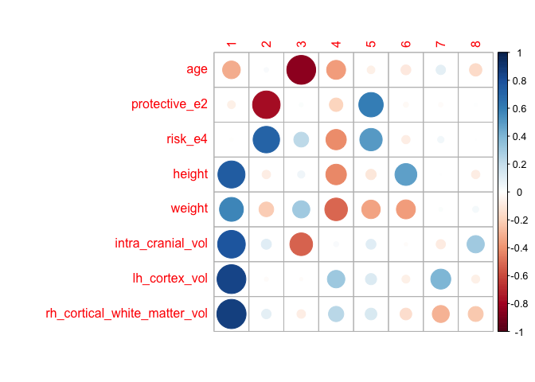
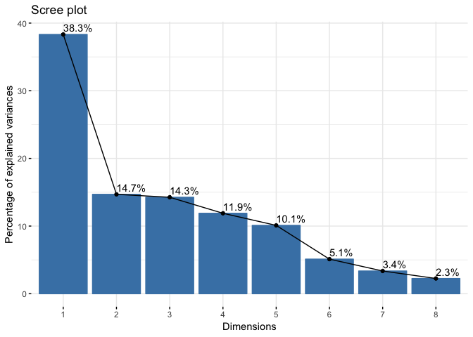
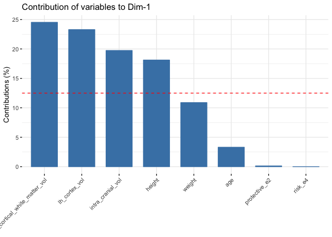
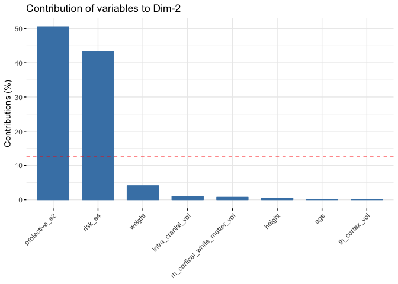
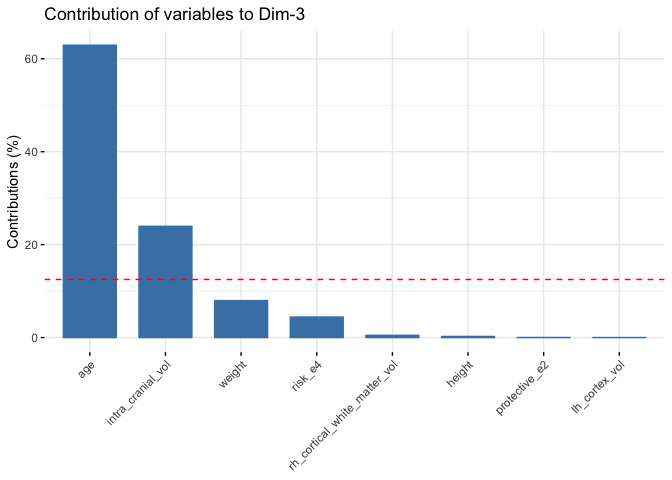
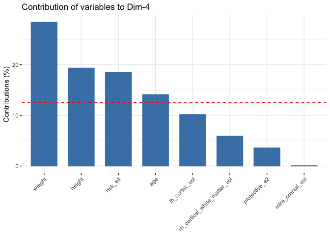
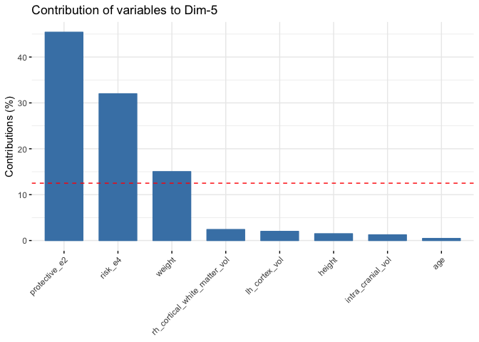
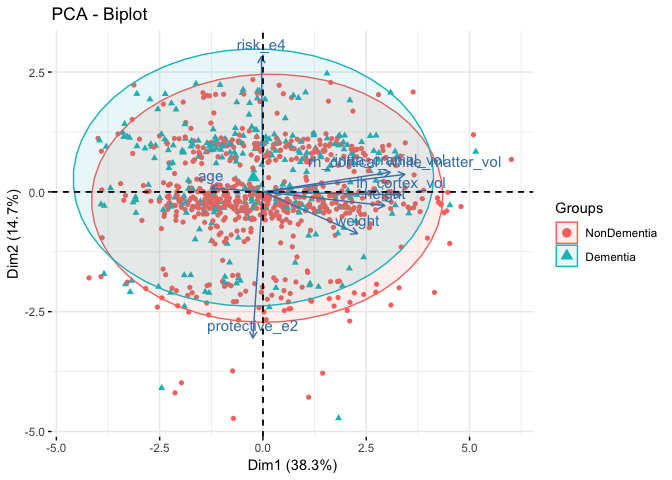
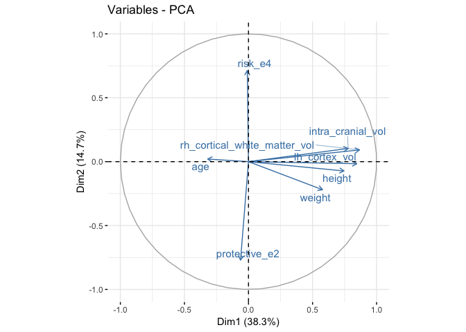
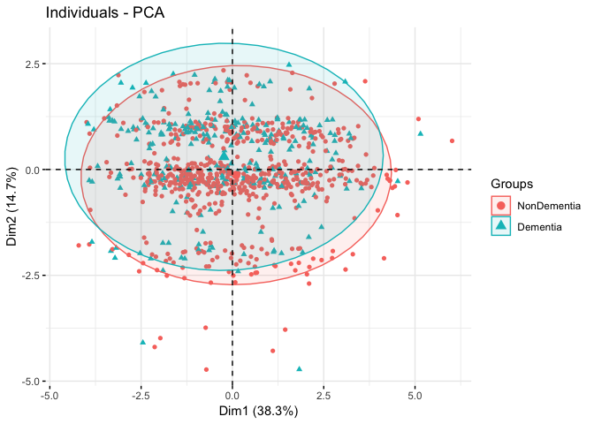

PCA
================

PCA
---

I needed to remove rows with missing values, which shrunk the dataset from 997 observations to 913. I also needed to center and scale the data.

``` r
cog = readRDS("./data/cog_data_preproc.RDS") %>% dplyr::select(-subject) %>% na.omit() # omit rows with NA
cog_pca = cog[, -1] %>% scale # center and scale the data

pca <- prcomp(na.omit(cog_pca))
pca$rotation
```

    ##                                       PC1         PC2          PC3
    ## age                          -0.181792222  0.01883532 -0.793213035
    ## protective_e2                -0.035431562 -0.71080004  0.014627374
    ## risk_e4                      -0.005558645  0.65755714  0.210219206
    ## height                        0.425678461 -0.06715557  0.049216045
    ## weight                        0.329966870 -0.20242096  0.282154874
    ## intra_cranial_vol             0.444327356  0.09544635 -0.489314660
    ## lh_cortex_vol                 0.482591287 -0.01490033 -0.009643952
    ## rh_cortical_white_matter_vol  0.495241211  0.08491764 -0.069653231
    ##                                      PC4         PC5         PC6
    ## age                          -0.37524313 -0.06722183 -0.15596903
    ## protective_e2                -0.18895538  0.67388703 -0.04115057
    ## risk_e4                      -0.43026479  0.56564352 -0.11045616
    ## height                       -0.43957434 -0.12172903  0.75846319
    ## weight                       -0.53269079 -0.38752089 -0.57289844
    ## intra_cranial_vol             0.02552174  0.11158397 -0.01675185
    ## lh_cortex_vol                 0.31874972  0.14124210 -0.10008920
    ## rh_cortical_white_matter_vol  0.24315190  0.15496517 -0.21909410
    ##                                       PC7         PC8
    ## age                           0.174747451 -0.37043314
    ## protective_e2                -0.037803142  0.01853754
    ## risk_e4                       0.078153133  0.00259781
    ## height                        0.001489853 -0.16897802
    ## weight                        0.027077969  0.08751280
    ## intra_cranial_vol            -0.169829645  0.71540847
    ## lh_cortex_vol                 0.781896083 -0.15446868
    ## rh_cortical_white_matter_vol -0.566557420 -0.53902410

``` r
pca$sdev
```

    ## [1] 1.7509752 1.0840957 1.0680518 0.9753509 0.8989908 0.6397461 0.5185913
    ## [8] 0.4247137

``` r
pca$rotation %*% diag(pca$sdev)
```

    ##                                      [,1]        [,2]        [,3]
    ## age                          -0.318313681  0.02041929 -0.84719262
    ## protective_e2                -0.062039789 -0.77057526  0.01562279
    ## risk_e4                      -0.009733049  0.71285486  0.22452500
    ## height                        0.745352448 -0.07280306  0.05256529
    ## weight                        0.577763822 -0.21944369  0.30135602
    ## intra_cranial_vol             0.778006202  0.10347298 -0.52261341
    ## lh_cortex_vol                 0.845005398 -0.01615338 -0.01030024
    ## rh_cortical_white_matter_vol  0.867155101  0.09205885 -0.07439326
    ##                                     [,4]       [,5]        [,6]
    ## age                          -0.36599373 -0.0604318 -0.09978058
    ## protective_e2                -0.18429781  0.6058182 -0.02632592
    ## risk_e4                      -0.41965916  0.5085083 -0.07066390
    ## height                       -0.42873924 -0.1094333  0.48522389
    ## weight                       -0.51956045 -0.3483777 -0.36650956
    ## intra_cranial_vol             0.02489265  0.1003130 -0.01071693
    ## lh_cortex_vol                 0.31089283  0.1269753 -0.06403168
    ## rh_cortical_white_matter_vol  0.23715843  0.1393123 -0.14016460
    ##                                       [,7]         [,8]
    ## age                           0.0906225097 -0.157328012
    ## protective_e2                -0.0196043810  0.007873145
    ## risk_e4                       0.0405295358  0.001103325
    ## height                        0.0007726249 -0.071767272
    ## weight                        0.0140423995  0.037167882
    ## intra_cranial_vol            -0.0880721782  0.303843746
    ## lh_cortex_vol                 0.4054845149 -0.065604957
    ## rh_cortical_white_matter_vol -0.2938117551 -0.228930895

``` r
corrplot::corrplot(pca$rotation %*% diag(pca$sdev))
```



``` r
factoextra::fviz_eig(pca, addlabels = TRUE)
```



``` r
factoextra::fviz_contrib(pca, choice = "var", axes = 1)
```



``` r
factoextra::fviz_contrib(pca, choice = "var", axes = 2)
```



``` r
factoextra::fviz_contrib(pca, choice = "var", axes = 3)
```



``` r
factoextra::fviz_contrib(pca, choice = "var", axes = 4)
```



``` r
factoextra::fviz_contrib(pca, choice = "var", axes = 5)
```



Based on the Scree plot, I'd say that the ideal number of PCs is 5. However, in terms of interpretability, I think 3 dimensions is probably sufficient. In the first PC, the white matter volume, cortex volume, cranial volume, and height are the most influential variables. In PC 2, the protective e2 allele and risk e4 allele contribute the most. In PC 3, age and intra-cranial volume. In PC 4, it's weight, height, risk e4 allele, and age. In PC 5, it's the protective e2 allele, risk e4 allele, and weight.

``` r
factoextra::fviz_pca_biplot(pca, 
                            axes = c(1, 2),
                            habillage = cog$cdr,
                            label = c("var"),
                            addEllipses = TRUE) 
```



``` r
factoextra::fviz_pca_var(pca, col.var = "steelblue", repel = TRUE)
```



``` r
factoextra::fviz_pca_ind(pca,
                         habillage = cog$cdr,
                         label = "none",
                         addEllipses = TRUE)
```



Above I give plots of associations only for comparing dimensions 1 and 2, but other comparisons for higher dimensions are similar; there is a lot of overlap between the group of patients with and without dimentia, which is our outcome of interest. It looks like it will be difficult to separate them, and we may not be able to fit a highly predictive model as a result.
